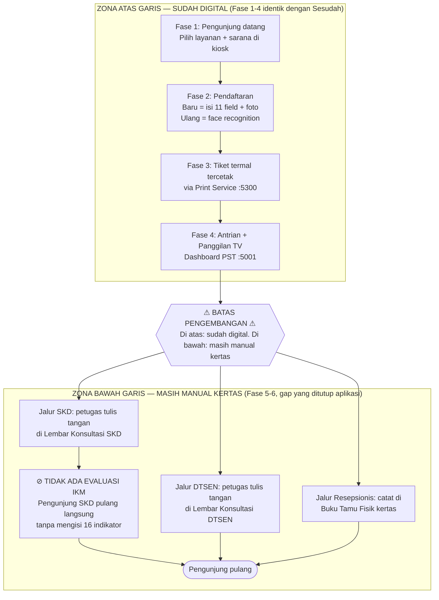
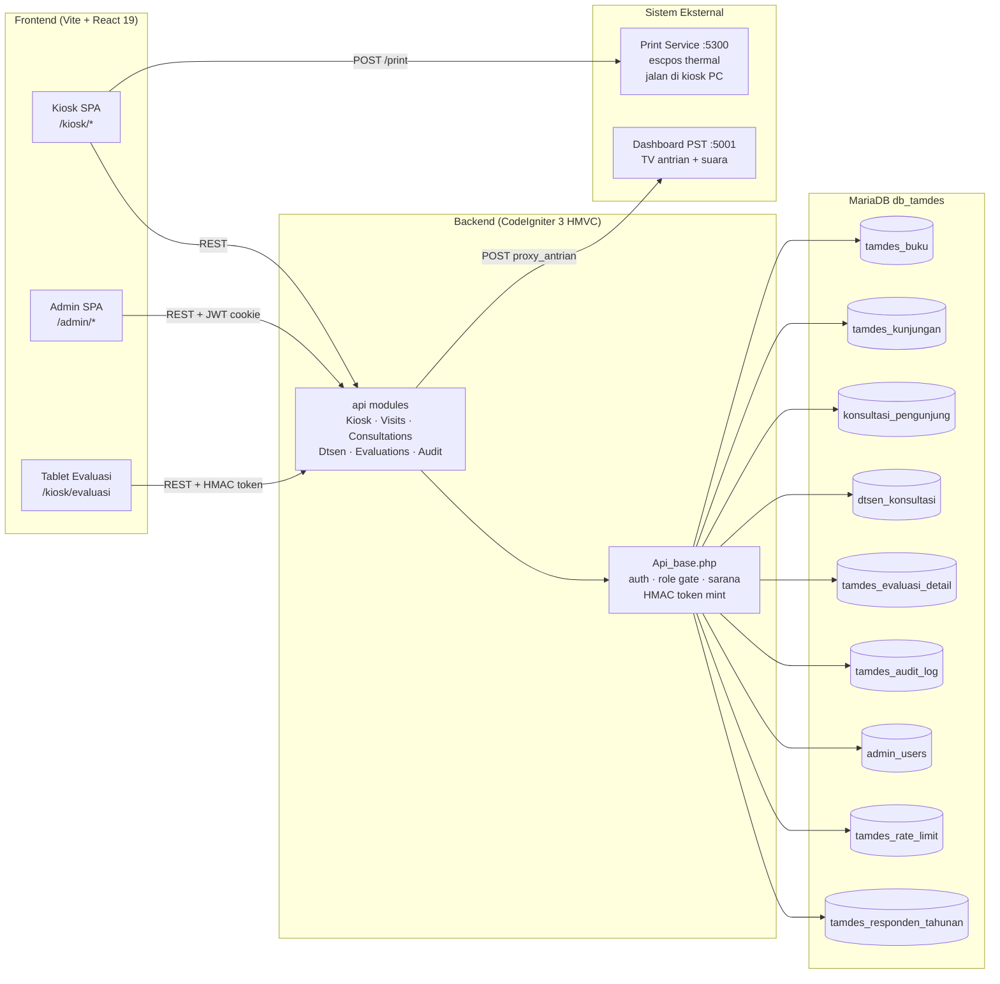
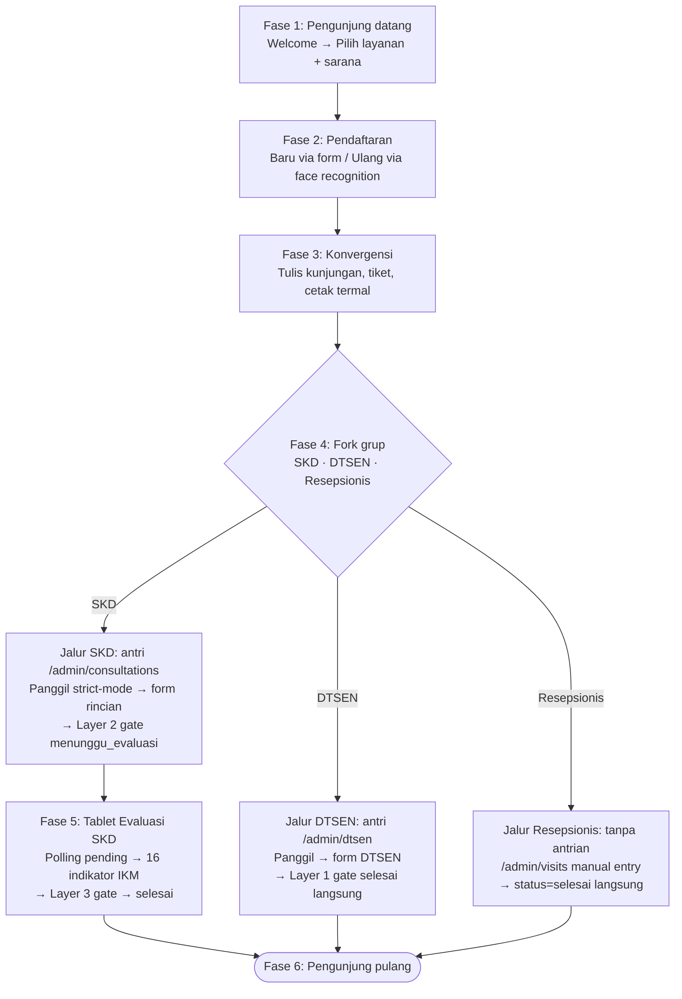
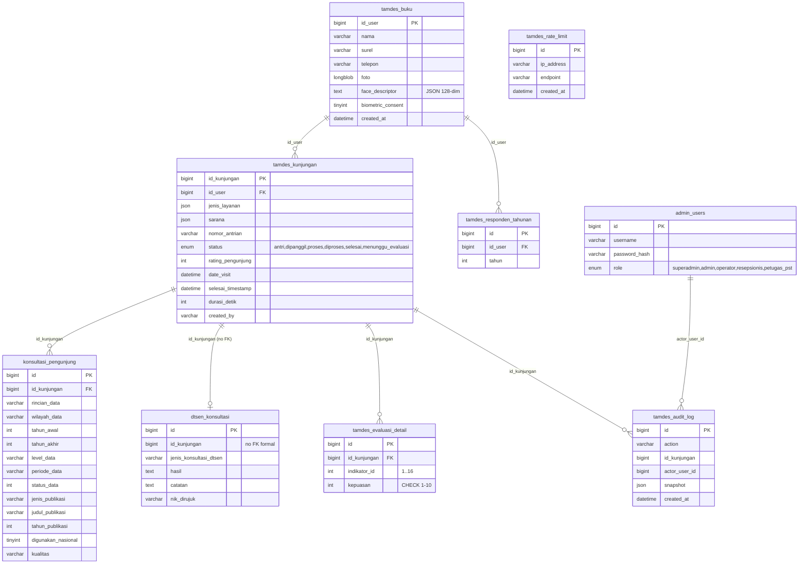
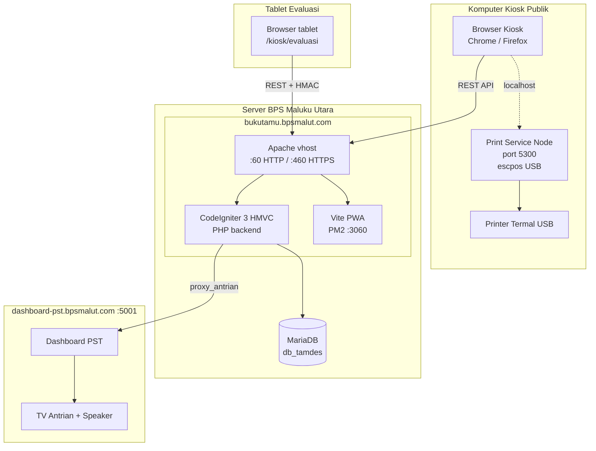

&nbsp;

&nbsp;

&nbsp;

# DOKUMEN RANCANGAN PENGEMBANGAN

# APLIKASI BUKU TAMU DIGITAL

# PELAYANAN STATISTIK TERPADU (PST)

&nbsp;

## *Studi Kasus: Pengembangan dari Pencatatan Manual ke Sistem Digital Terintegrasi dengan Pengenalan Wajah, Antrian Tiga-Tier, dan Evaluasi IKM*

&nbsp;

&nbsp;

&nbsp;

**Badan Pusat Statistik Provinsi Maluku Utara**

&nbsp;

&nbsp;

| | |
|---|---|
| **Versi Dokumen** | 1.0 |
| **Tanggal** | {{TANGGAL_PENERBITAN, mis. 19 Mei 2026}} |
| **Status** | Final / Untuk Diklat Prakom |
| **Penyusun** | {{NAMA_PENYUSUN}} |
| **NIP** | {{NIP_PENYUSUN}} |
| **Jabatan** | {{JABATAN, mis. Calon Ahli Pertama – Pranata Komputer}} |
| **Unit Kerja** | {{UNIT_KERJA, mis. BPS Provinsi Maluku Utara}} |
| **Versi Aplikasi** | Bukutamu v1.0 (post-konsolidasi 2026-05-16) |

&nbsp;

&nbsp;

&nbsp;

**TERNATE — {{TAHUN, mis. 2026}}**

\pagebreak

# Daftar Isi

1. [BAB I — Pendahuluan](#bab-i--pendahuluan)
2. [BAB II — Kondisi Sebelum Pengembangan](#bab-ii--kondisi-sebelum-pengembangan)
3. [BAB III — Rancangan Sistem Sesudah Pengembangan](#bab-iii--rancangan-sistem-sesudah-pengembangan)
4. [BAB IV — Perbandingan Sebelum ↔ Sesudah](#bab-iv--perbandingan-sebelum--sesudah)
5. [BAB V — Spesifikasi Fitur Utama](#bab-v--spesifikasi-fitur-utama)
6. [BAB VI — Flowchart Sistem](#bab-vi--flowchart-sistem)
7. [BAB VII — Rancangan Basis Data](#bab-vii--rancangan-basis-data)
8. [BAB VIII — Spesifikasi API](#bab-viii--spesifikasi-api)
9. [BAB IX — Arsitektur Teknis dan Stack Teknologi](#bab-ix--arsitektur-teknis-dan-stack-teknologi)
10. [BAB X — Keamanan dan Defense-in-Depth](#bab-x--keamanan-dan-defense-in-depth)
11. [BAB XI — Penutup](#bab-xi--penutup)
12. [Lampiran A — Daftar Singkatan](#lampiran-a--daftar-singkatan)
13. [Lampiran B — Glosarium](#lampiran-b--glosarium)
14. [Lampiran C — Referensi Kode Sumber](#lampiran-c--referensi-kode-sumber)

\pagebreak

# BAB I — Pendahuluan

## 1.1 Latar Belakang

Pelayanan Statistik Terpadu (PST) Badan Pusat Statistik Provinsi Maluku Utara melayani dua kelompok pengunjung utama setiap hari kerja: **konsumen data statistik** yang datang untuk mengakses perpustakaan, berkonsultasi statistik, meminta rekomendasi kegiatan, atau membeli produk publikasi; dan **pemangku kepentingan internal** yang menghadiri rapat di ruang-ruang internal kantor (Halmahera, Vicon, Gamalama, Pimpinan). Sejak diluncurkannya Survei Kebutuhan Data (SKD) yang menjadi indikator kinerja unit PST seluruh Indonesia, pelayanan ini tidak lagi sekadar transaksi tatap muka — setiap kunjungan adalah satu titik data umpan balik yang harus terukur, tertelusur, dan terdokumentasi secara digital.

Sebelum aplikasi Buku Tamu Digital dikembangkan secara penuh, sebagian alur sudah terdigitalisasi (pendaftaran kiosk, pencetakan tiket termal, pemanggilan TV) namun sebagian besar pencatatan masih dilakukan **di atas kertas**: lembar konsultasi SKD, lembar konsultasi DTSEN, buku tamu fisik resepsionis, dan kuesioner kepuasan dibawa pulang secara manual. Akibatnya, transisi status kunjungan tidak tertelusur setelah pemanggilan, hasil konsultasi tidak masuk basis data sehingga tidak bisa dilaporkan secara *real-time*, dan kuesioner SKD baru direkapitulasi belakangan dengan risiko kehilangan lembar fisik.

Pengembangan ini menutup kesenjangan tersebut dengan **menggabungkan komponen yang sudah digital dan komponen yang masih manual ke dalam satu alur kerja terintegrasi**, dilengkapi dengan tiga lapis pertahanan otomatis (*soft-correct gate*) yang menjamin tidak ada kunjungan SKD yang dapat ditutup sebelum responden mengisi evaluasi kepuasan.

## 1.2 Identifikasi Masalah (Kondisi Sebelum)

Berdasarkan observasi alur pengunjung yang berjalan (lihat **Bab II** dan flowchart "Sebelum Pengembangan"), teridentifikasi lima masalah utama:

1. **Tidak ada endpoint API untuk pencatatan rincian konsultasi.** Endpoint berikut belum tersedia: `POST /api/consultations/data`, `POST /api/dtsen/{id}/data`, `PUT /api/visits/{id}/status`, tiga lapis gate (Layer 1/2/3), dan fungsi `require_layanan_role()`.
2. **Tabel-tabel detail kosong / belum ada.** Tabel `konsultasi_pengunjung`, `dtsen_konsultasi`, dan `tamdes_evaluasi_detail` tidak terisi data. Status `tamdes_kunjungan` tertinggal di nilai `dipanggil` dan tidak pernah berpindah ke `selesai`. Audit log finalisasi tidak ada.
3. **Tidak ada fase evaluasi tablet.** Pengunjung SKD pulang langsung tanpa pernah mengisi 16 indikator IKM. Endpoint `GET /api/evaluations/pending`, `POST /api/evaluations/{id}`, HMAC token `eval-submit`, Layer 3 gate, dan tablet evaluasi terpisah belum ada.
4. **Pencatatan resepsionis di buku tamu fisik.** Setiap pengunjung yang ke ruangan internal dicatat dengan tulisan tangan di buku tamu yang tidak terhubung ke basis data manapun.
5. **Pencatatan konsultasi DTSEN di lembar kertas terpisah.** Form cetak yang berisi jenis konsultasi, hasil, catatan, dan NIK rujukan tidak terintegrasi dengan sistem antrian maupun laporan responden tahunan.

## 1.3 Tujuan Pengembangan

Tujuan utama pengembangan dirumuskan sebagai berikut:

1. **Mendigitalisasi tiga jalur pencatatan** (SKD, DTSEN, Resepsionis) ke dalam satu basis data terpadu (`db_tamdes`).
2. **Memperkenalkan taksonomi layanan 3-tier** yang memisahkan SKD, DTSEN, dan Resepsionis dengan aturan finalisasi yang berbeda — menggantikan taksonomi 2-tier (PST/Resepsionis) yang ada di sistem warisan (legacy).
3. **Menjamin tidak ada kunjungan SKD yang lolos tanpa evaluasi IKM** melalui tiga lapis *soft-correct gate* yang menutup celah baik di sisi penulisan data (write-side) maupun pembacaan (read-side).
4. **Mengintegrasikan pemanggilan antrian dengan dashboard TV** secara **strict-mode**: bila Dashboard PST di port 5001 gagal merespons, transisi status tidak terjadi dan kejadian dicatat ke audit log.
5. **Menambahkan validasi sisi grup** untuk kombinasi layanan × sarana × peran petugas, mencegah penggabungan layanan lintas-grup dalam satu kunjungan.
6. **Memberikan jejak audit lengkap** untuk setiap transisi status, panggilan TV, finalisasi konsultasi, dan operasi penghapusan administratif.

## 1.4 Ruang Lingkup

| Cakupan | Termasuk | Tidak Termasuk |
|---|---|---|
| Aktor | Pengunjung, Petugas PST, Petugas DTSEN, Resepsionis, Operator, Admin, Superadmin | Stakeholder pimpinan yang tidak berinteraksi langsung dengan sistem |
| Layanan | 7 jenis layanan: 4 inti SKD (Perpustakaan, Konsultasi Statistik, Rekomendasi, Penjualan), Konsultasi DTSEN, Keperluan Pimpinan, Lainnya | Layanan di luar PST (mis. layanan SIM Kepegawaian internal) |
| Saluran | Kiosk publik, Tablet evaluasi, Browser admin, Printer termal lokal, Dashboard TV | Akses lewat aplikasi mobile, integrasi web service eksternal di luar BPS |
| Data | Identitas pengunjung, kunjungan, konsultasi, DTSEN, evaluasi 16 indikator IKM, audit log, rate-limit | Data layanan di luar `db_tamdes` |

## 1.5 Manfaat

**Bagi pengunjung** — proses pendaftaran lebih cepat untuk kunjungan ulang (pengenalan wajah ~3 detik), tiket termal segera dicetak, dan pemanggilan TV terdengar jelas; bagi pengunjung SKD, kuesioner evaluasi tersaji di tablet dengan antarmuka skala Likert 1–10 yang sederhana.

**Bagi petugas** — antrian SKD dan DTSEN tampil di halaman yang berbeda sesuai tanggung jawab; form rincian konsultasi langsung tersimpan ke basis data; tidak perlu lagi menulis tangan ke lembar kertas; kesalahan operasional (mis. menutup kasus SKD tanpa evaluasi) dicegah secara otomatis di sisi backend.

**Bagi manajemen** — laporan responden tahunan SKD dapat di-*query* langsung dari basis data; rating rata-rata, durasi pelayanan, dan distribusi indikator IKM tersedia tanpa rekap manual; jejak audit penuh memudahkan investigasi bila ada keluhan.

## 1.6 Metodologi Penyusunan Dokumen

Dokumen ini disusun dengan tiga sumber data primer yang saling melengkapi:

1. **Diagram alur dari berkas Diklat Prakom** — dua halaman pertama berkas `Diklat Prakom.drawio` yang menggambarkan *cross-functional flowchart* (ISO 5807:1985) untuk kondisi Sebelum dan Sesudah Pengembangan pengunjung PST.
2. **Dokumen `FLOW_PENGUNJUNG.md`** — lima diagram Mermaid sumber yang merupakan dekomposisi resmi alur sesudah pengembangan, dengan rujukan endpoint dan kolom basis data yang sudah terverifikasi terhadap kode aktual.
3. **Dokumen `BUKUTAMU_VS_LEGACY.md` dan kode sumber aktif** — sebagai sumber kebenaran *side-by-side* untuk apa yang berubah relatif terhadap sistem warisan di `/var/www/html/bukutamu-legacy/`.

Bila terjadi perbedaan antara diagram dan kode, kode aktif diutamakan sebagai *source of truth*; perbedaan ditulis di **§9 Catatan Inkonsistensi** dokumen `FLOW_PENGUNJUNG.md`.

\pagebreak

# BAB II — Kondisi Sebelum Pengembangan

## 2.1 Gambaran Umum

Sebelum pengembangan, alur kunjungan PST dapat dibagi menjadi **dua zona** yang dipisahkan oleh garis batas pengembangan:

- **Zona atas garis (sudah digital)** — identifikasi pengunjung, pendaftaran, pencetakan tiket, antrian dan pemanggilan TV.
- **Zona bawah garis (masih manual)** — pencatatan rincian konsultasi, pencatatan kunjungan resepsionis, dan pengukuran kepuasan IKM.

Komponen di zona atas garis identik secara fungsional dengan sistem sesudah pengembangan. Perbedaan justru terjadi di zona bawah garis, yang ditutup oleh aplikasi baru.

## 2.2 Komponen yang Sudah Digital (Existing)

| Komponen | Implementasi Sebelum | Kondisi |
|---|---|---|
| Identifikasi pengunjung | Form 11 field VisitorForm + face recognition (face-api.js) | Sudah digital, dipertahankan |
| Pengenalan kunjungan ulang | Cosine similarity ≥ 0,55 dengan margin ≥ 0,08, fallback pencarian nama manual | Sudah digital, dipertahankan |
| Pendaftaran baru | `POST /api/kiosk/register` dengan LOCK TABLES atas `tamdes_buku` + `tamdes_kunjungan` | Sudah digital, dipertahankan |
| Pencetakan tiket | Print Service di `localhost:5300` mencetak tiket termal langsung dari browser kiosk | Sudah digital, dipertahankan |
| Antrian dan pemanggilan TV | Dashboard PST `:5001` menerima panggilan; nomor antrian + nama diumumkan suara dan tampil di TV | Sudah digital, dipertahankan |

## 2.3 Komponen yang Masih Manual (Gap)

| Komponen | Praktik Manual Sebelum | Akibat |
|---|---|---|
| Pencatatan konsultasi SKD | Petugas menulis tangan di **Lembar Konsultasi SKD** (form cetak / buku) | Tidak ada baris di `konsultasi_pengunjung`, status `tamdes_kunjungan` tertinggal di `dipanggil` |
| Pencatatan konsultasi DTSEN | Petugas DTSEN menulis tangan di **Lembar Konsultasi DTSEN** terpisah | Tabel `dtsen_konsultasi` belum ada |
| Pencatatan resepsionis | Resepsionis menulis tangan di **Buku Tamu Fisik** (kolom: nama, instansi, tanggal, keperluan, tanda tangan) | Tidak ada baris di `tamdes_kunjungan` untuk pengunjung resepsionis |
| Evaluasi IKM SKD | **Tidak ada** — pengunjung pulang langsung | 16 indikator IKM, rating keseluruhan, dan kualitas per data tidak terukur |
| Finalisasi status kunjungan | Tidak ada endpoint `PUT /api/visits/{id}/status` | Status macet, jejak audit tidak ada |
| Validasi peran petugas | Tidak ada fungsi `require_layanan_role()` | Siapapun bisa menutup catatan, tidak ada kontrol akses berbasis grup |

## 2.4 Flowchart Kondisi Sebelum Pengembangan

Diagram di bawah ini diadaptasi dari halaman pertama berkas `Diklat Prakom.drawio` (judul: "Flow Pengunjung PST — Sebelum"). Garis batas pengembangan (⚠ BATAS PENGEMBANGAN) ditandai eksplisit; komponen di bawah garis adalah cakupan yang ditutup aplikasi baru.

## 2.5 Daftar Inkonsistensi dan Risiko pada Kondisi Sebelum

| # | Risiko / Inkonsistensi | Dampak |
|---|---|---|
| R1 | Status kunjungan tidak pernah `selesai` | Laporan harian tidak akurat, antrian terlihat selalu "berjalan" |
| R2 | Lembar konsultasi fisik bisa hilang / rusak | Data SKD tidak dapat direkap, kinerja unit terkompromikan |
| R3 | Tidak ada pengukuran IKM | Indikator BPS pusat (16 indikator IKM) tidak terlaporkan |
| R4 | Buku tamu resepsionis tidak tertelusur | Investigasi keamanan / forensik tamu pimpinan sulit |
| R5 | Tidak ada validasi peran finalisasi | Petugas DTSEN dapat menutup kasus SKD secara aksidental, dan sebaliknya |
| R6 | Tidak ada audit log finalisasi | Tidak ada jejak siapa yang menutup kasus kapan |

\pagebreak

# BAB III — Rancangan Sistem Sesudah Pengembangan

## 3.1 Visi dan Tujuan Sistem Baru

Sistem Buku Tamu Digital PST versi 1.0 dirancang berdasarkan prinsip **"identifikasi tetap, pencatatan jadi digital, kepuasan terukur"**. Komponen identifikasi yang sudah berjalan baik (face recognition, form pendaftaran, antrian) **dipertahankan tanpa perubahan**, sementara gap di pencatatan rincian dan evaluasi ditutup dengan endpoint baru, tabel basis data baru, dan halaman antarmuka petugas dan tablet baru.

Visi sistem dirangkum dalam tiga kalimat:

1. **Tidak ada kunjungan yang tidak tercatat.** Setiap pengunjung — baik konsumen SKD, klien DTSEN, maupun tamu resepsionis — meninggalkan jejak digital lengkap di `db_tamdes`.
2. **Tidak ada kunjungan SKD yang tidak terukur.** Setiap kunjungan SKD harus melewati evaluasi 16 indikator IKM sebelum dapat dinyatakan `selesai`, dijamin oleh tiga lapis *soft-correct gate*.
3. **Setiap aksi tertelusur.** Pemanggilan, finalisasi, pembaruan status, dan penghapusan administratif tercatat di `tamdes_audit_log`.

## 3.2 Aktor Sistem

Sistem mendefinisikan tujuh peran aktor, lima di antaranya merupakan **peran ENUM** pada kolom `admin_users.role`.

| Aktor | Tipe | Hak Utama |
|---|---|---|
| Pengunjung | Eksternal (anonim) | Akses kiosk publik, tablet evaluasi |
| Petugas PST (`petugas_pst`) | Internal | Antrian SKD + form konsultasi, finalisasi SKD |
| Petugas DTSEN | Internal (`petugas_pst` dengan akses `/admin/dtsen`) | Antrian DTSEN + form DTSEN, finalisasi DTSEN |
| Resepsionis (`resepsionis`) | Internal | Pencatatan manual kunjungan front-office |
| Operator (`operator`) | Internal | Akses *read-only* + bypass status finalisasi |
| Admin (`admin`) | Internal | Manajemen pengguna, DELETE kunjungan, bypass finalisasi |
| Superadmin (`superadmin`) | Internal | Akses penuh termasuk konfigurasi sistem |

## 3.3 Taksonomi Layanan 3-Tier

Layanan dibagi menjadi tiga grup yang **saling terpisah** (*mutually exclusive*):

| Grup | Layanan | Sarana Valid | Status Finalisasi | Prefix Antrian |
|---|---|---|---|---|
| **SKD** | Perpustakaan, Konsultasi Statistik, Rekomendasi, Penjualan | 1, 2, 4, 9, 16, 32 | `menunggu_evaluasi` → `selesai` setelah eval | `P`/`K`/`R`/`J` |
| **DTSEN** | Konsultasi DTSEN | 1 saja (datang langsung) | `selesai` langsung | `D` |
| **Resepsionis** | Keperluan Pimpinan, Lainnya | 33, 34, 35, 36 (ruangan internal) | `selesai` langsung (tidak masuk antrian) | — |

Pemisahan ini ditegakkan dengan dua mekanisme:

1. **Validasi sisi frontend** (`isCrossLayanan` di `frontend/src/lib/role-access.ts`) memblokir tombol Lanjut bila kombinasi layanan campur grup terpilih.
2. **Validasi sisi backend** (`Api_base::validate_no_cross_layanan()`) menolak `POST /api/kiosk/register` dan `POST /api/kiosk/visit` dengan HTTP 422 bila campuran lolos dari frontend.

## 3.4 Arsitektur Tingkat Tinggi

## 3.5 Flowchart Master Kondisi Sesudah

Diagram master di bawah ini diadaptasi dari halaman kedua berkas `Diklat Prakom.drawio` (judul: "Flow Pengunjung PST — Sesudah") dan merepresentasikan keenam fase alur pengunjung lengkap. Dekomposisi rinci tiap fase disajikan di **BAB VI**.

\pagebreak

# BAB IV — Perbandingan Sebelum ↔ Sesudah

Matriks komparasi berikut diadaptasi langsung dari halaman pertama drawio (bagian "PERBANDINGAN: SEBELUM ↔ SESUDAH PENGEMBANGAN — apa yang ditambah aplikasi").

## 4.1 Matriks Komparasi Per Aspek

| Aspek | Sebelum (existing) | Sesudah (digital baru) |
|---|---|---|
| **Identifikasi pengunjung** | Sudah digital — face recognition + form 11 field di kiosk | Sama (tidak diubah) |
| **Pengunjung ulang** | Sudah digital — cosine similarity 0,55 + margin 0,08, fallback manual | Sama (tidak diubah) |
| **Antrian dan tiket** | Sudah digital — nomor antrian dicetak termal di `:5300` | Sama (tidak diubah) |
| **Pemanggilan TV** | Sudah digital — Dashboard `:5001`, status `antri → dipanggil` | Sama (tidak diubah) |
| **Pencatatan rincian konsultasi SKD** | Manual — form / lembar kertas, tidak masuk DB | Digital — tabel `konsultasi_pengunjung` (DELETE-INSERT) |
| **Pencatatan rincian konsultasi DTSEN** | Manual — lembar kertas terpisah | Digital — tabel `dtsen_konsultasi` (INSERT, cascade manual) |
| **Status kunjungan setelah dipanggil** | Tidak tertelusur — status macet di `dipanggil` | `antri → dipanggil → diproses → menunggu_evaluasi / selesai` |
| **3-Layer soft-correct gate** | Tidak ada | Layer 1 (`/visits/status`) · Layer 2 (`/consultations`) · Layer 3 (`/evaluations`) |
| **Validasi peran (`require_layanan_role`)** | Tidak ada — siapapun bisa menutup catatan | Aktif di setiap finalisasi; role bypass khusus admin / superadmin / operator |
| **Audit log finalisasi** | Tidak ada (hanya audit panggilan yang sudah eksis) | `tamdes_audit_log`: `update_status`, `update_service` per transisi |
| **Evaluasi kualitas (IKM)** | Tidak ada — pengunjung pulang langsung | 16 indikator Likert di tablet evaluasi; HMAC token TTL 10 menit |
| **Pencatatan kunjungan resepsionis** | Manual — buku tamu fisik | Digital — `/admin/visits` manual entry; INSERT `status=selesai` langsung |
| **Laporan dan analitik back-office** | Hitung manual dari lembar / buku fisik | Query langsung ke `db_tamdes`; `rating`, `durasi_detik`, IKM per indikator |
| **Pemisahan antrian SKD vs DTSEN** | Tidak — sebelumnya tidak ada layanan DTSEN | Antrian terpisah: `/admin/consultations` (4 inti SKD) vs `/admin/dtsen` |
| **Validasi sarana × layanan** | Tidak — kode sarana apapun bisa di-attach | Whitelist per grup: SKD `{1,2,4,9,16,32}`, DTSEN `{1}`, Resepsionis `{33..36}` |
| **Cross-group block** | Tidak — bisa mix Perpustakaan + Pimpinan dalam satu visit | Ditolak — SKD ⊕ DTSEN ⊕ Resepsionis (saling eksklusif) |
| **DELETE visit dengan cascade** | Tidak ada — orphan rows mungkin terjadi | Admin / superadmin only; cascade ke 3 child + audit snapshot |
| **HMAC continuation token** | Tidak ada — endpoint kiosk bisa di-*replay* dari mana saja | `profile-update` 5 menit + `eval-submit` 10 menit; header `X-Kiosk-Token` |
| **Rate limiting endpoint kiosk** | Tidak ada | 30 req/menit/IP di `face-data` dan `guest-list`; catat ke `tamdes_rate_limit` |
| **Strict-mode panggilan TV** | Optimistic — status berpindah meski dashboard timeout | Strict — HTTP 502 + audit `call_queue_failed` bila dashboard gagal; **DB tidak berubah** |

## 4.2 Ringkasan Apa yang Baru, Apa yang Sama

### Yang BARU (tidak ada di kondisi sebelum)

- Layanan **Konsultasi DTSEN** + tabel `dtsen_konsultasi` + controller `Dtsen.php` + halaman admin DTSEN
- Taksonomi 3-tier layanan (SKD / DTSEN / Resepsionis)
- Cross-layanan validation
- Sarana whitelist per grup
- Soft-correct status gate di Visits PUT dan Consultations PUT
- Eval-side gate di POST `/evaluations/{id}`
- Strict-mode TV queue call
- Antrian PST difilter (hanya 4 inti SKD)
- Prefix nomor antrian per layanan
- DELETE visit dengan cascade ke 3 child + audit log capture
- Kiosk HMAC continuation token
- Tablet evaluasi 16 indikator IKM
- Rate-limit endpoint enumeration kiosk

### Yang SAMA (tidak boleh diubah tanpa alasan)

- Skema `konsultasi_pengunjung` (kolom rincian data, status data, kualitas)
- 16 indikator SKD + skor keseluruhan 1–10 + kualitas per data
- Skema `tamdes_buku`, `tamdes_kunjungan`, `tamdes_evaluasi_detail`
- Controller `Responden.php` (line-for-line identik dengan legacy)
- Pipeline face recognition (warmup 600 ms, 5 descriptor averaging, threshold 0,55 / margin 0,08)
- Print server lokal di kiosk PC (browser fetch ke `localhost:5300` — backend tidak mediate)

\pagebreak

# BAB V — Spesifikasi Fitur Utama

## 5.1 Pendaftaran Kunjungan Baru

**Tujuan**: mendaftarkan pengunjung yang **belum pernah** terdaftar di sistem.

**Alur**:
1. Pengunjung mengisi 11 field `VisitorForm`: nama, surel, telepon, jenis kelamin, umur, disabilitas, pendidikan, pekerjaan, kategori instansi, nama instansi, pemanfaatan.
2. Halaman `/kiosk/capture` menampilkan modal `PhotoDisclaimer` untuk persetujuan biometrik eksplisit.
3. Kamera mengumpulkan minimal **3 sampel** (`MIN_SAMPLES_TO_CAPTURE`) untuk mengaktifkan tombol **Ambil Foto**; selanjutnya 5 descriptor 128-dim dikumpulkan dan dirata-rata.
4. Konfirmasi memicu `POST /api/kiosk/register` yang melakukan `LOCK TABLES tamdes_buku WRITE, tamdes_kunjungan WRITE, tamdes_responden_tahunan WRITE` untuk mencegah balapan antar kiosk.
5. Foto disimpan sebagai `LONGBLOB`; descriptor disimpan sebagai JSON 128-dim; `biometric_consent` ditandai `1`.

**Endpoint utama**: `POST /api/kiosk/register`
**Tabel terlibat**: `tamdes_buku`, `tamdes_kunjungan`, `tamdes_responden_tahunan`

## 5.2 Pendaftaran Kunjungan Ulang (Face Recognition)

**Tujuan**: mengenali pengunjung yang **sudah pernah** terdaftar tanpa harus mengisi ulang form.

**Alur**:
1. Halaman `/kiosk/recognize` melakukan **warmup 600 ms** untuk menstabilkan `face-api.js`.
2. Browser memanggil `GET /api/kiosk/face-data` (rate-limit 30/menit/IP) untuk mengambil seluruh descriptor terdaftar.
3. Sampling 5 descriptor dilakukan dan dirata-rata menjadi satu vektor 128-dim.
4. Pencocokan menggunakan **dua kondisi sekaligus**: cosine similarity ≥ **0,55** *dan* margin terhadap kandidat kedua ≥ **0,08**.
5. Bila cocok, halaman menyapa pengunjung lalu memanggil `GET /api/kiosk/profile-gaps/{id_user}` yang **mint HMAC token** `profile-update` TTL 5 menit.
6. Bila tidak cocok, modal `GuestPickerModal` menarik daftar nama via `GET /api/kiosk/guest-list` (juga rate-limited). Bila pengunjung memilih nama, alur masuk ke jalur profile-gap. Bila tidak ditemukan, sistem *fallback* ke `/kiosk/form` dengan membawa state layanan.

**Konstanta tuning** (`frontend/src/components/kiosk/FaceRecognize.tsx`):

| Konstanta | Nilai | Makna |
|---|---|---|
| `WARMUP_MS` | 600 | Durasi warmup face-api.js |
| `SAMPLE_COUNT` | 5 | Banyak descriptor untuk averaging |
| `MATCH_THRESHOLD` | 0,55 | Ambang minimum cosine similarity |
| `MATCH_MARGIN` | 0,08 | Margin ke kandidat kedua |
| `MIN_SAMPLES_TO_CAPTURE` | 3 | Banyak sampel minimum agar tombol Ambil Foto aktif |

## 5.3 Antrian Digital Terpisah (SKD vs DTSEN)

**Tujuan**: memisahkan beban kerja petugas dan menghindari kebingungan urutan panggilan.

| Aspek | Antrian SKD | Antrian DTSEN |
|---|---|---|
| Endpoint backend | `GET /api/consultations` (filter 4 inti SKD) | `GET /api/dtsen` (filter `Konsultasi DTSEN`) |
| Prefix nomor antrian | `P` Perpustakaan · `K` Konsultasi · `R` Rekomendasi · `J` Penjualan | `D` |
| Halaman admin | `/admin/consultations`, `/admin/consultations/{id}/form` | `/admin/dtsen`, `/admin/dtsen/{id}/form` |
| Form data | Multi-row `konsultasi_pengunjung` | Single-row `dtsen_konsultasi` |
| Status finalisasi | `menunggu_evaluasi` → tablet eval → `selesai` | `selesai` langsung |
| Muncul di tablet eval? | Ya | **Tidak** |

## 5.4 Pemanggilan Strict-Mode ke Dashboard TV

**Tujuan**: menjamin status `dipanggil` di basis data **konsisten** dengan apa yang benar-benar disiarkan TV.

**Alur**:
1. Petugas menekan tombol **Panggil** di `/admin/consultations`.
2. Backend memanggil `POST /api/consultations/{id}/call` yang mem-proxy ke Dashboard PST di `:5001`.
3. Bila Dashboard merespons `200 OK` → transisi `antri → dipanggil` ditulis, audit `call_queue` dicatat.
4. Bila Dashboard timeout / 5xx → backend mengembalikan **HTTP 502**, audit `call_queue_failed` dicatat, **kolom `status` di `tamdes_kunjungan` TIDAK diubah**.

Aturan ini berkebalikan dengan praktik *optimistic update* di sistem warisan, dan dirancang untuk mencegah baris dengan `status=dipanggil` ada di basis data sementara TV antrian sebenarnya tidak mengumumkan panggilan apapun.

## 5.5 Pencatatan Rincian Konsultasi SKD

**Tujuan**: menggantikan lembar konsultasi kertas dengan form digital multi-row.

**Alur**: setelah konsumen tiba di meja, petugas mengisi form rincian. Setiap baris di tabel form mewakili satu item data yang dikonsultasikan. Submit memicu `POST /api/consultations/data` yang melakukan **DELETE-INSERT** terhadap `konsultasi_pengunjung WHERE id_kunjungan = ?` (idempotent untuk koreksi).

**Kolom yang dicatat per baris**:

| Kolom | Tipe | Keterangan |
|---|---|---|
| `rincian_data` | varchar | Subject data yang dicari |
| `wilayah_data` | varchar | Cakupan geografis |
| `tahun_awal`, `tahun_akhir` | int | Rentang tahun data |
| `level_data` | varchar | Provinsi, Kabupaten, dll |
| `periode_data` | varchar | Tahunan, Triwulanan, dll |
| `status_data` | int | 1 = Ya sesuai, 2 = Ya tidak sesuai, 3 = Tidak ada |
| `jenis_publikasi`, `judul_publikasi`, `tahun_publikasi` | varchar / int | Bila merujuk publikasi BPS |
| `digunakan_nasional` | tinyint | Indikasi pemanfaatan |
| `kualitas` | varchar(255) | Diisi belakangan saat evaluasi tablet |

## 5.6 Pencatatan Konsultasi DTSEN

**Tujuan**: menggantikan lembar konsultasi DTSEN kertas dengan form single-row.

**Endpoint**: `POST /api/dtsen/{id}/data`
**Tabel**: `dtsen_konsultasi` (kolom: `jenis_konsultasi_dtsen`, `hasil`, `catatan`, `nik_dirujuk`)

**Catatan teknis**: Tabel ini punya indeks pada `id_kunjungan` tetapi **tidak punya constraint FK formal** ke `tamdes_kunjungan`. Akibatnya, cascade delete harus dipanggil manual dari `Visits.php` (lihat §5.13).

## 5.7 Pencatatan Resepsionis Digital

**Tujuan**: menggantikan buku tamu fisik dengan entri admin `/admin/visits` untuk tamu ke ruangan internal.

**Alur**:
1. Pengunjung yang akan ke Halmahera / Vicon / Gamalama / Pimpinan tidak diberi tiket antrian — diarahkan langsung secara verbal.
2. Resepsionis membuka `/admin/visits` (Manual Entry Page) dan memasukkan data pengunjung.
3. Submit memicu `POST /api/visits` yang langsung melakukan INSERT ke `tamdes_kunjungan` dengan `status=selesai`.

**Sarana wajib** untuk grup Resepsionis: salah satu dari `33` (R. Halmahera), `34` (R. Vicon), `35` (R. Gamalama), `36` (R. Pimpinan).

## 5.8 Evaluasi Tablet 16 Indikator IKM

**Tujuan**: mengukur kepuasan pengunjung SKD melalui kuesioner Likert 1–10 yang disajikan di tablet terpisah dari kiosk pendaftaran.

**Alur**:
1. Tablet menampilkan halaman `/kiosk/evaluasi` (Standby) dengan animasi titik tiga.
2. Halaman melakukan **polling** `GET /api/evaluations/pending` setiap **5 detik**.
3. Bila ada visit ber-status `menunggu_evaluasi`, backend **mint HMAC token** `eval-submit` TTL **10 menit** dan mengembalikan `id_kunjungan`.
4. Tablet otomatis berpindah ke `/kiosk/evaluasi/:id` dengan token di *route state*.
5. Halaman memanggil `GET /api/evaluations/{id}` (header `X-Kiosk-Token`) untuk memuat metadata visit dan data konsultasi terkait.
6. Konsumen mengisi **16 indikator Likert 1–10** + **skor keseluruhan**; bila visit punya data konsultasi dengan `status_data ∈ {1,2}`, kolom **kualitas per item** ikut ditampilkan.
7. Submit memicu `POST /api/evaluations/{id}`. Backend menjalankan **Layer 3 gate** (visit harus berada di `menunggu_evaluasi` atau `selesai`), lalu DELETE-INSERT 16 baris ke `tamdes_evaluasi_detail` dan UPDATE `tamdes_kunjungan.status=selesai` + `selesai_timestamp` + `durasi_detik`.
8. Tablet menampilkan "Terima Kasih" 4 detik lalu kembali ke standby.

**Catatan skema**: satu baris per indikator (16 baris per kunjungan), bukan satu baris dengan 16 kolom — keputusan ini mempermudah perhitungan rata-rata per indikator bila daftar IKM berubah.

## 5.9 Three-Layer Defense-in-Depth Gate

**Tujuan**: menjamin tidak ada visit SKD yang dapat dinyatakan `selesai` tanpa melewati evaluasi IKM, bahkan bila salah satu lapis pertahanan terlewat.

| Lapis | Lokasi | Fungsi |
|---|---|---|
| **Layer 1** | `PUT /api/visits/{id}/status` di `Visits.php` | Bila payload `status='selesai'` tetapi visit termasuk SKD-4, paksa koreksi ke `menunggu_evaluasi` (kecuali role bypass) |
| **Layer 2** | `PUT /api/consultations/{id}` di `Consultations.php` | Logika identik dengan Layer 1, tapi di endpoint yang dipakai antrian PST |
| **Layer 3** | `POST /api/evaluations/{id}` di `Evaluations.php` | Tolak submit evaluasi bila visit bukan SKD-4 (mencegah evaluasi aksidental untuk DTSEN / Resepsionis) |

**Role bypass**: `admin`, `superadmin`, `operator` dapat menutup kasus SKD langsung ke `selesai` tanpa evaluasi — disediakan untuk koreksi data administratif.

## 5.10 Print Service Lokal Termal

**Tujuan**: mencetak tiket termal langsung dari browser kiosk **tanpa** melalui backend pusat, sebagai desain anti *single-point-of-failure*.

**Arsitektur**: Setiap PC kiosk menjalankan layanan Node.js (`/var/www/html/bukutamu/print`) di port `5300` yang menggunakan pustaka `escpos` untuk berkomunikasi langsung dengan printer USB termal. Browser kiosk melakukan `POST http://localhost:5300/print` dengan payload `{ nomor_antrian, nama, jenis_layanan, no, sarana }`.

**Kompatibilitas payload**: field `no` adalah alias `nomor_antrian` yang dipertahankan untuk kompatibilitas dengan implementasi awal. Backend Bukutamu **tidak** terlibat dalam alur cetak.

## 5.11 Audit Log Lengkap

**Tujuan**: jejak forensik untuk setiap perubahan status, panggilan TV, dan operasi administratif.

Tabel `tamdes_audit_log` mencatat baris untuk setiap kejadian berikut:

| Action | Pemicu |
|---|---|
| `call_queue` | Panggilan TV sukses |
| `call_queue_failed` | Panggilan TV gagal (Dashboard `:5001` tidak merespons) |
| `update_status` | Transisi `tamdes_kunjungan.status` |
| `update_service` | Perubahan kolom `jenis_layanan` / `sarana` |
| `delete_visit` | Penghapusan administratif (capture full row sebelum delete) |

## 5.12 Manajemen Pengguna dan Role-Based Access Control

Tabel `admin_users` menyimpan akun internal. Kolom `role` adalah ENUM dengan lima nilai: `superadmin`, `admin`, `operator`, `resepsionis`, `petugas_pst`.

Fungsi `Api_base::require_layanan_role()` memetakan grup layanan ke peran yang berwenang memfinalisasi:

| Grup Layanan | Peran yang Berwenang | Role Bypass |
|---|---|---|
| SKD (4 inti) | `petugas_pst` | `admin`, `superadmin`, `operator` |
| DTSEN | `petugas_pst` (akses `/admin/dtsen`) | `admin`, `superadmin`, `operator` |
| Resepsionis | `resepsionis` | `admin`, `superadmin` |

## 5.13 DELETE Visit dengan Cascade Manual

`DELETE /api/visits/{id}` hanya dapat dipanggil oleh `admin` / `superadmin`. Urutan operasi:

1. INSERT ke `tamdes_audit_log` (action `delete_visit`, capture full row sebelum delete).
2. `DELETE FROM konsultasi_pengunjung WHERE id_kunjungan = ?`
3. `DELETE FROM dtsen_konsultasi WHERE id_kunjungan = ?`
4. `DELETE FROM tamdes_evaluasi_detail WHERE id_kunjungan = ?`
5. `DELETE FROM tamdes_kunjungan WHERE id_kunjungan = ?`

**Implikasi pemeliharaan**: bila ada penambahan tabel anak baru yang mereferensikan `id_kunjungan`, *cascade chain* di `Visits.php` **wajib** diperbarui — karena `dtsen_konsultasi` tidak punya FK formal, MariaDB tidak akan otomatis cascade.

\pagebreak

# BAB VI — Flowchart Sistem

Bab ini menyajikan dekomposisi lengkap alur Sesudah Pengembangan dalam lima diagram Mermaid bersimbol ISO 5807:1985, masing-masing dengan empat *swimlane* vertikal: **Konsumen / Kiosk Publik**, **Backend / API**, **MariaDB / db_tamdes**, **Petugas / Sistem Eksternal**.

## 6.1 Diagram 1 — Master: Pengunjung Datang hingga Pulang

```mermaid
flowchart LR
    subgraph KIOSK ["Konsumen / Kiosk Publik"]
        direction TB
        K_START([Pengunjung datang])
        K_W[/Welcome /kiosk//]
        K_SVC[/Pilih layanan + sarana/]
        K_SVCQ{Valid &amp; tidak<br/>campur grup?}
        K_STA[/Pilih status<br/>baru atau ulang/]
        K_STAQ{Sudah pernah<br/>daftar?}
        K_FORM[/Isi data + ambil foto/]
        K_REC[/Scan wajah/]
        K_RECQ{Wajah cocok?}
        K_MAN[/Modal cari nama manual/]
        K_MANQ{Ditemukan?}
        K_TIX[/Tiket antrian/]
        K_WAIT[Tunggu di ruang tunggu]
        K_GRP{Grup layanan?}
        K_EVALQ{Visit menunggu_evaluasi?}
        K_EVAL[/Isi 16 indikator IKM<br/>di tablet evaluasi/]
        K_END([Pengunjung pulang])
    end

    subgraph API ["Backend / API"]
        direction TB
        A_REG[POST /api/kiosk/register]
        A_VIS[POST /api/kiosk/visit]
        A_FIN[Finalisasi visit<br/>via PUT visits/consultations]
        A_EVAL[POST /api/evaluations/&#123;id&#125;]
    end

    subgraph DB ["MariaDB / db_tamdes"]
        direction TB
        D_BUKU[(tamdes_buku)]
        D_KUN[(tamdes_kunjungan)]
        D_KP[(konsultasi_pengunjung)]
        D_DT[(dtsen_konsultasi)]
        D_EVAD[(tamdes_evaluasi_detail)]
    end

    subgraph EXT ["Petugas / Sistem Eksternal"]
        direction TB
        E_PRINT[[Print Service :5300<br/>Cetak tiket termal]]
        E_PST[Petugas PST: Pelayanan SKD]
        E_DTSEN[Petugas DTSEN: Pelayanan DTSEN]
        E_RES[Resepsionis: Catat manual<br/>ruangan internal 33-36]
    end

    K_START --> K_W --> K_SVC --> K_SVCQ
    K_SVCQ -- Tidak --> K_SVC
    K_SVCQ -- Ya --> K_STA --> K_STAQ
    K_STAQ -- Tidak --> K_FORM
    K_STAQ -- Ya --> K_REC --> K_RECQ
    K_RECQ -- Ya --> A_VIS
    K_RECQ -- Tidak --> K_MAN --> K_MANQ
    K_MANQ -- Ya --> A_VIS
    K_MANQ -- Tidak --> K_FORM
    K_FORM --> A_REG
    A_REG --> D_BUKU
    A_REG --> D_KUN
    A_VIS --> D_KUN
    D_KUN --> K_TIX
    K_TIX --> E_PRINT
    E_PRINT --> K_WAIT --> K_GRP
    K_GRP -- SKD --> E_PST
    K_GRP -- DTSEN --> E_DTSEN
    K_GRP -- Resepsionis --> E_RES
    E_PST --> A_FIN
    E_DTSEN --> A_FIN
    E_RES --> A_FIN
    A_FIN --> D_KP
    A_FIN --> D_DT
    A_FIN --> D_KUN
    D_KUN --> K_EVALQ
    K_EVALQ -- Ya --> K_EVAL --> A_EVAL --> D_EVAD --> D_KUN
    K_EVALQ -- Tidak --> K_END
    D_EVAD --> K_END
```

## 6.2 Diagram 2 — Pendaftaran Kunjungan Baru

```mermaid
flowchart LR
    subgraph KIOSK ["Konsumen / Kiosk Publik"]
        direction TB
        K_STA[/Status: Belum Pernah Daftar/]
        K_FORM[/Isi 11 field VisitorForm/]
        K_FORMQ{Semua field valid?}
        K_CAP[/Halaman /kiosk/capture/]
        K_DIS[/Modal PhotoDisclaimer<br/>persetujuan biometrik/]
        K_DISQ{Setuju ambil foto?}
        K_CAM[Kamera aktif<br/>face-api.js sampling]
        K_SAMQ{Sample wajah &ge; 3?}
        K_SHOT[Klik Ambil Foto<br/>5 descriptor terkumpul]
        K_KON[/Konfirmasi &amp; Daftar/]
        K_TIX[/Halaman /kiosk/ticket/:id/]
    end

    subgraph API ["Backend / API"]
        direction TB
        A_REG[POST /api/kiosk/register<br/>LOCK TABLES buku + kunjungan]
        A_REGQ{Insert berhasil?}
        A_TIX[GET /api/kiosk/ticket/&#123;id&#125;]
    end

    subgraph DB ["MariaDB / db_tamdes"]
        direction TB
        D_BUKU[(tamdes_buku<br/>INSERT: identitas, foto,<br/>face_descriptor 128-dim,<br/>biometric_consent)]
        D_KUN[(tamdes_kunjungan<br/>INSERT: id_user, jenis_layanan,<br/>sarana, nomor_antrian, status=antri)]
        D_RESP[(tamdes_responden_tahunan<br/>UPSERT cohort SKD)]
    end

    subgraph EXT ["Petugas / Sistem Eksternal"]
        direction TB
        E_PRINT[[Print Service :5300<br/>POST /print payload]]
        E_PAPER[/Tiket termal fisik tercetak/]
    end

    K_STA --> K_FORM --> K_FORMQ
    K_FORMQ -- Tidak --> K_FORM
    K_FORMQ -- Ya --> K_CAP --> K_DIS --> K_DISQ
    K_DISQ -- Tidak --> K_FORM
    K_DISQ -- Ya --> K_CAM --> K_SAMQ
    K_SAMQ -- Tidak --> K_CAM
    K_SAMQ -- Ya --> K_SHOT --> K_KON --> A_REG
    A_REG --> D_BUKU
    A_REG --> D_KUN
    A_REG --> D_RESP
    A_REG --> A_REGQ
    A_REGQ -- Tidak --> K_KON
    A_REGQ -- Ya --> A_TIX
    A_TIX --> D_KUN
    A_TIX --> K_TIX
    K_TIX --> E_PRINT --> E_PAPER
```

## 6.3 Diagram 3 — Pendaftaran Kunjungan Ulang (Face Recognition)

```mermaid
flowchart LR
    subgraph KIOSK ["Konsumen / Kiosk Publik"]
        direction TB
        K_STA[/Status: Sudah Pernah/]
        K_REC[/Halaman /kiosk/recognize/]
        K_WARM[Warmup 600 ms]
        K_SAMP[Sampling 5 descriptor]
        K_MATCH{Cosine sim &ge; 0,55<br/>&amp; margin &ge; 0,08?}
        K_HI[/Sapa Selamat datang kembali/]
        K_GAPSQ{Ada profile gap?}
        K_GAPM[/Modal lengkapi profil/]
        K_MAN[/Modal cari nama manual/]
        K_MANQ{Pilih dari daftar?}
        K_CONF[/Konfirmasi Kunjungan/]
        K_FORM[/Fallback ke /kiosk/form/]
        K_TIX[/Tiket antrian/]
    end

    subgraph API ["Backend / API"]
        direction TB
        A_FD[GET /api/kiosk/face-data<br/>rate-limit 30/menit/IP]
        A_GL[GET /api/kiosk/guest-list<br/>rate-limit 30/menit/IP]
        A_PG[GET /api/kiosk/profile-gaps/&#123;id_user&#125;<br/>mint HMAC token TTL 5 menit]
        A_PU[POST /api/kiosk/profile-update/&#123;id_user&#125;<br/>header X-Kiosk-Token]
        A_VIS[POST /api/kiosk/visit]
    end

    subgraph DB ["MariaDB / db_tamdes"]
        direction TB
        D_BUKU[(tamdes_buku<br/>SELECT face_descriptor<br/>UPDATE field gap)]
        D_RL[(tamdes_rate_limit<br/>INSERT per request)]
        D_KUN[(tamdes_kunjungan<br/>INSERT status=antri)]
    end

    subgraph EXT ["Petugas / Sistem Eksternal"]
        direction TB
        E_PRINT[[Print Service :5300]]
    end

    K_STA --> K_REC --> A_FD
    A_FD --> D_BUKU
    A_FD --> D_RL
    A_FD --> K_WARM --> K_SAMP --> K_MATCH
    K_MATCH -- Ya --> K_HI --> A_PG
    A_PG --> D_BUKU
    A_PG --> K_GAPSQ
    K_GAPSQ -- Ya --> K_GAPM --> A_PU
    A_PU --> D_BUKU
    A_PU --> K_CONF
    K_GAPSQ -- Tidak --> K_CONF
    K_CONF --> A_VIS
    A_VIS --> D_KUN
    A_VIS --> K_TIX
    K_MATCH -- Tidak --> K_MAN --> A_GL
    A_GL --> D_BUKU
    A_GL --> D_RL
    A_GL --> K_MANQ
    K_MANQ -- Ya --> K_HI
    K_MANQ -- Tidak --> K_FORM
    K_TIX --> E_PRINT
```

## 6.4 Diagram 4 — Pelayanan dan Finalisasi (3-Layer Gate)

```mermaid
flowchart LR
    subgraph KIOSK ["Konsumen / Kiosk Publik"]
        direction TB
        K_WAIT[Tunggu di ruang tunggu]
        K_CALLED[/Mendengar panggilan<br/>nama + nomor antrian/]
        K_MEJA[/Mendekati meja layanan/]
        K_DONE_S[/SKD: menuju tablet evaluasi/]
        K_DONE_D[/DTSEN: menuju pintu keluar/]
        K_DONE_R[/Resepsionis: menuju pintu keluar/]
    end

    subgraph API ["Backend / API"]
        direction TB
        A_QUEUE[GET /api/consultations<br/>filter 4 inti SKD]
        A_QUEUE_D[GET /api/dtsen]
        A_CALL[POST /api/consultations/&#123;id&#125;/call<br/>proxy_antrian ke :5001]
        A_CALLQ{Dashboard :5001<br/>respons OK?}
        A_CALLOK[UPDATE status antri to dipanggil]
        A_CALLFAIL[HTTP 502 + audit<br/>DB TIDAK berubah]
        A_FORM[POST /api/consultations/data]
        A_DFORM[POST /api/dtsen/&#123;id&#125;/data]
        A_RVIS[POST /api/visits manual entry]
        A_FIN1[PUT /api/visits/&#123;id&#125;/status<br/>LAYER 1 soft-correct gate]
        A_FIN2[PUT /api/consultations/&#123;id&#125;<br/>LAYER 2 soft-correct gate]
        A_GRP{Layanan SKD?}
        A_BYP{Role bypass?<br/>admin/superadmin/operator}
        A_SET_EVAL[Set status = menunggu_evaluasi]
        A_SET_FIN[Set status = selesai<br/>+ selesai_timestamp + durasi_detik]
    end

    subgraph DB ["MariaDB / db_tamdes"]
        direction TB
        D_KUN[(tamdes_kunjungan<br/>UPDATE status berturut-turut)]
        D_KP[(konsultasi_pengunjung<br/>DELETE-INSERT)]
        D_DT[(dtsen_konsultasi<br/>INSERT — NO FK formal)]
        D_AUD[(tamdes_audit_log)]
    end

    subgraph EXT ["Petugas / Sistem Eksternal"]
        direction TB
        E_PST[Petugas PST: Klik Panggil]
        E_DPST[Petugas DTSEN: Buka /admin/dtsen]
        E_RES[Resepsionis: Buka /admin/visits]
        E_DASH[[Dashboard PST :5001<br/>Panggilan TV + suara]]
        E_DONE_PST[Petugas PST: Klik Selesai]
    end

    K_WAIT --> A_QUEUE
    A_QUEUE --> D_KUN
    A_QUEUE --> E_PST
    E_PST --> A_CALL
    A_CALL --> E_DASH
    E_DASH --> A_CALLQ
    A_CALLQ -- Ya --> A_CALLOK
    A_CALLOK --> D_KUN
    A_CALLOK --> D_AUD
    A_CALLOK --> K_CALLED
    A_CALLQ -- Tidak --> A_CALLFAIL
    A_CALLFAIL --> D_AUD
    A_CALLFAIL --> E_PST
    K_CALLED --> K_MEJA --> A_FORM
    A_FORM --> D_KP
    A_FORM --> E_DONE_PST
    E_DONE_PST --> A_FIN2
    A_FIN2 --> A_GRP
    A_QUEUE_D --> D_KUN
    A_QUEUE_D --> E_DPST
    E_DPST --> A_DFORM
    A_DFORM --> D_DT
    A_DFORM --> A_FIN1
    K_WAIT -.tanpa antrian.-> E_RES
    E_RES --> A_RVIS
    A_RVIS --> D_KUN
    A_RVIS --> A_FIN1
    A_FIN1 --> A_GRP
    A_GRP -- Ya SKD --> A_BYP
    A_GRP -- Tidak DTSEN/Resepsionis --> A_SET_FIN
    A_BYP -- Ya --> A_SET_FIN
    A_BYP -- Tidak --> A_SET_EVAL
    A_SET_EVAL --> D_KUN
    A_SET_EVAL --> K_DONE_S
    A_SET_FIN --> D_KUN
    A_SET_FIN --> D_AUD
    A_SET_FIN -- DTSEN --> K_DONE_D
    A_SET_FIN -- Resepsionis --> K_DONE_R
```

## 6.5 Diagram 5 — Evaluasi Tablet (khusus SKD)

```mermaid
flowchart LR
    subgraph KIOSK ["Konsumen / Kiosk Publik"]
        direction TB
        T_SBY[/Halaman /kiosk/evaluasi Standby/]
        T_NAV[/Tablet auto-navigate ke<br/>/kiosk/evaluasi/:id/]
        T_TOKQ{Token di route state?}
        T_FORM[/Tampil 16 indikator IKM<br/>Likert 1-10/]
        T_KUAL[/Opsional: skor kualitas<br/>per data konsultasi/]
        T_VALQ{Semua 16 terisi?}
        T_SUB[/Klik Kirim/]
        T_THX[/Terima kasih 4 detik/]
        T_BACK[/Kembali ke standby/]
    end

    subgraph API ["Backend / API"]
        direction TB
        A_PEND[GET /api/evaluations/pending<br/>polling 5 detik]
        A_PENDQ{Ada visit menunggu_evaluasi?}
        A_TOK[Mint HMAC token eval-submit<br/>TTL 10 menit]
        A_GET[GET /api/evaluations/&#123;id&#125;]
        A_POST[POST /api/evaluations/&#123;id&#125;]
        A_GATE{LAYER 3 GATE:<br/>status menunggu_evaluasi<br/>atau selesai?}
        A_DEL[DELETE existing rows]
        A_INS[Loop INSERT 16 baris]
        A_FIN[UPDATE tamdes_kunjungan:<br/>status=selesai +<br/>rating + durasi_detik]
        A_ERR[HTTP 400 Evaluasi belum tersedia]
    end

    subgraph DB ["MariaDB / db_tamdes"]
        direction TB
        D_KUN[(tamdes_kunjungan)]
        D_EVAD[(tamdes_evaluasi_detail<br/>CHECK 1-10)]
        D_KP[(konsultasi_pengunjung<br/>UPDATE kualitas)]
    end

    subgraph EXT ["Petugas / Sistem Eksternal"]
        direction TB
        E_NONE[Tablet beroperasi mandiri]
    end

    T_SBY --> A_PEND
    A_PEND --> D_KUN
    A_PEND --> A_PENDQ
    A_PENDQ -- Tidak --> T_SBY
    A_PENDQ -- Ya --> A_TOK --> T_NAV --> T_TOKQ
    T_TOKQ -- Tidak --> T_SBY
    T_TOKQ -- Ya --> A_GET
    A_GET --> D_KUN
    A_GET --> D_KP
    A_GET --> T_FORM --> T_KUAL --> T_VALQ
    T_VALQ -- Tidak --> T_FORM
    T_VALQ -- Ya --> T_SUB --> A_POST --> A_GATE
    A_GATE -- Tidak --> A_ERR --> T_FORM
    A_GATE -- Ya --> A_DEL --> A_INS --> A_FIN
    A_DEL --> D_EVAD
    A_INS --> D_EVAD
    A_FIN --> D_KUN
    A_FIN --> D_KP
    A_FIN --> T_THX --> T_BACK --> T_SBY
```

\pagebreak

# BAB VII — Rancangan Basis Data

## 7.1 Entity Relationship Diagram (ERD)

## 7.2 Daftar Tabel

| Tabel | Tujuan | Tipe |
|---|---|---|
| `tamdes_buku` | Identitas tamu (master) | Master |
| `tamdes_kunjungan` | Satu baris per visit | Transaksi |
| `konsultasi_pengunjung` | Rincian konsultasi SKD (multi-row) | Detail |
| `dtsen_konsultasi` | Rincian konsultasi DTSEN (single-row) | Detail |
| `tamdes_evaluasi_detail` | 16 indikator IKM per visit SKD | Detail |
| `tamdes_responden_tahunan` | Kohort responden SKD tahunan | Agregat |
| `tamdes_audit_log` | Jejak audit semua transisi | Audit |
| `admin_users` | Akun internal | Master |
| `tamdes_rate_limit` | Penghitung rate-limit per IP | Operasional |

## 7.3 Spesifikasi Kolom Kritis

### 7.3.1 `tamdes_kunjungan` — Kolom Utama

| Kolom | Tipe | Catatan |
|---|---|---|
| `id_kunjungan` | bigint PK | Auto-increment |
| `id_user` | bigint FK | Referensi `tamdes_buku.id_user` |
| `jenis_layanan` | json | Array berisi 1+ kode layanan dari `Services.php` |
| `sarana` | json | Array berisi 1+ kode sarana (bitmask BPS 1-32 + custom 33-36) |
| `nomor_antrian` | varchar | Prefix `P`/`K`/`R`/`J`/`D` + sekuensial harian |
| `status` | enum | `antri`, `dipanggil`, `proses`, `diproses`, `selesai`, `menunggu_evaluasi` |
| `rating_pengunjung` | int | 1-10, diisi saat submit evaluasi |
| `date_visit` | datetime | Waktu pendaftaran |
| `selesai_timestamp` | datetime | Waktu finalisasi |
| `durasi_detik` | int | `selesai_timestamp - date_visit` |
| `created_by` | varchar | `kiosk`, `resepsionis`, `admin`, dll |

### 7.3.2 Kode Sarana (`tamdes_kunjungan.sarana`)

| Kode | Nama | Grup |
|---|---|---|
| 1 | Datang Langsung | SKD, DTSEN |
| 2 | Email | SKD |
| 4 | Telepon | SKD |
| 9 | Web | SKD |
| 16 | Media Sosial | SKD |
| 32 | Surat | SKD |
| 33 | R. Halmahera | Resepsionis |
| 34 | R. Vicon | Resepsionis |
| 35 | R. Gamalama | Resepsionis |
| 36 | R. Pimpinan | Resepsionis |

Kode 1-32 adalah **bitmask BPS standar** yang dapat dikombinasikan dengan operasi bitwise (mis. `1 | 2 = 3` artinya datang langsung + email). Kode 33-36 sekuensial untuk ruangan internal.

## 7.4 Transisi Status `tamdes_kunjungan.status`

| Dari | Ke | Endpoint Pemicu | Grup |
|---|---|---|---|
| *(insert)* | `antri` | `POST /api/kiosk/register`, `POST /api/kiosk/visit` | Semua |
| `antri` | `dipanggil` | `POST /api/consultations/{id}/call` | SKD |
| `dipanggil` | `diproses` | `PUT /api/visits/{id}/status` | SKD, DTSEN |
| `diproses` | `menunggu_evaluasi` | `PUT /api/visits/{id}/status` atau `PUT /api/consultations/{id}` | SKD |
| `diproses` | `selesai` | idem (role bypass) | SKD bypass |
| `diproses` | `selesai` | `PUT /api/visits/{id}/status` | DTSEN |
| *(insert)* | `selesai` | `POST /api/visits` (manual entry resepsionis) | Resepsionis |
| `menunggu_evaluasi` | `selesai` | `POST /api/evaluations/{id}` | SKD |

ENUM kolom: `('antri','dipanggil','proses','diproses','selesai','menunggu_evaluasi')`. Nilai `proses` ada di ENUM namun **tidak dipakai** oleh kode aktif — peninggalan skema lama yang dipertahankan agar migrasi tidak destruktif.

## 7.5 Migrasi yang Diterapkan

Migrasi DDL dipisah ke file di `docs/migrations/`:

| Tanggal | File | Tujuan |
|---|---|---|
| 2026-05-17 | `2026-05-17-rate-limit.sql` | Membuat tabel `tamdes_rate_limit` untuk throttling kiosk |

\pagebreak

# BAB VIII — Spesifikasi API

## 8.1 Daftar Endpoint

| Method | Path | Tujuan | Tabel | Auth |
|---|---|---|---|---|
| GET | `/api/services` | Daftar 7 jenis layanan (hardcoded) | — | Tidak |
| GET | `/api/kiosk/face-data` | Ambil seluruh descriptor wajah | `tamdes_buku`, `tamdes_rate_limit` | Rate-limit 30/menit/IP |
| GET | `/api/kiosk/guest-list` | Daftar nama untuk pencarian manual | `tamdes_buku`, `tamdes_rate_limit` | Rate-limit |
| POST | `/api/kiosk/register` | Daftar pengunjung baru | `tamdes_buku`, `tamdes_kunjungan`, `tamdes_responden_tahunan` | LOCK TABLES |
| POST | `/api/kiosk/visit` | Daftar kunjungan ulang | `tamdes_kunjungan` | Tidak |
| GET | `/api/kiosk/profile-gaps/{id}` | Cek field kosong + mint HMAC token | `tamdes_buku` | Tidak |
| POST | `/api/kiosk/profile-update/{id}` | Update field kosong | `tamdes_buku` | HMAC `profile-update` |
| GET | `/api/kiosk/ticket/{id}` | Data tiket untuk halaman cetak | `tamdes_kunjungan` + `tamdes_buku` | Tidak |
| GET | `/api/consultations` | Antrian 4 inti SKD hari ini | `tamdes_kunjungan` | JWT cookie |
| POST | `/api/consultations/{id}/call` | Panggil ke TV (strict-mode) | `tamdes_kunjungan`, `tamdes_audit_log` | JWT cookie |
| POST | `/api/consultations/data` | Simpan rincian konsultasi SKD | `konsultasi_pengunjung` | JWT cookie + `require_layanan_role` |
| PUT | `/api/consultations/{id}` | Finalisasi (Layer 2 gate) | `tamdes_kunjungan` | JWT cookie + `require_layanan_role` |
| GET | `/api/dtsen` | Antrian DTSEN | `tamdes_kunjungan` | JWT cookie |
| POST | `/api/dtsen/{id}/data` | Simpan rincian konsultasi DTSEN | `dtsen_konsultasi` | JWT cookie + `require_layanan_role` |
| PUT | `/api/visits/{id}/status` | Update status (Layer 1 gate) | `tamdes_kunjungan`, `tamdes_audit_log` | JWT cookie + `require_layanan_role` |
| POST | `/api/visits` | Manual entry resepsionis | `tamdes_kunjungan` | JWT cookie + role `resepsionis`/`admin` |
| DELETE | `/api/visits/{id}` | Hapus visit + cascade | semua child | JWT cookie + role `admin`/`superadmin` |
| GET | `/api/evaluations/pending` | Polling visit menunggu evaluasi | `tamdes_kunjungan` | Tidak (rate-limited) |
| GET | `/api/evaluations/{id}` | Detail visit untuk form evaluasi | `tamdes_kunjungan`, `konsultasi_pengunjung` | HMAC `eval-submit` |
| POST | `/api/evaluations/{id}` | Submit evaluasi (Layer 3 gate) | `tamdes_evaluasi_detail`, `tamdes_kunjungan`, `konsultasi_pengunjung` | HMAC `eval-submit` |

## 8.2 Continuation Token HMAC

| Token | TTL | Di-mint di | Diperiksa di | Header pembawa |
|---|---|---|---|---|
| `profile-update` | 5 menit | `GET /api/kiosk/profile-gaps/{id_user}` | `POST /api/kiosk/profile-update/{id_user}` | `X-Kiosk-Token` |
| `eval-submit` | 10 menit | `GET /api/evaluations/pending` | `GET /api/evaluations/{id}`, `POST /api/evaluations/{id}` | `X-Kiosk-Token` |

**Format token**: `{purpose}.{bound_id}.{exp_unix}.{base64url-hmac-sha256}`.

- *Purpose claim* — memastikan token tidak dapat dipakai lintas endpoint
- *Bound-id claim* — mengikat token ke satu `id_user` atau `id_kunjungan`
- *Exp claim* — membatasi jendela serangan *replay*

## 8.3 Rate Limiting

Tabel `tamdes_rate_limit` mencatat satu baris per request dengan kolom `ip_address`, `endpoint`, `created_at`. Fungsi `Api_base::require_rate_limit($endpoint, $limit_per_minute)` melakukan `COUNT(*)` rolling-window 60 detik dan mengembalikan HTTP 429 bila terlampaui.

| Endpoint | Limit |
|---|---|
| `GET /api/kiosk/face-data` | 30 / menit / IP |
| `GET /api/kiosk/guest-list` | 30 / menit / IP |

Catatan: rate-limit ini **bukan perimeter keamanan**, hanya memperlambat *bulk scraping* identitas dan descriptor. Untuk pencegahan enumerasi sejati, batasi IP sumber di level Apache vhost.

\pagebreak

# BAB IX — Arsitektur Teknis dan Stack Teknologi

## 9.1 Diagram Komponen Deployment

## 9.2 Stack Teknologi

| Lapisan | Stack | Versi |
|---|---|---|
| Frontend (kiosk + admin + tablet) | Vite + React + TypeScript, TanStack Query, Tailwind CSS, `face-api.js` | Vite 8, React 19, Tailwind v4 |
| Backend API | CodeIgniter 3 dengan ekstensi HMVC | PHP 8.x |
| Database | MariaDB | 10.x |
| Print Service | Node.js + Express + `escpos` | Node 18+ |
| Reverse Proxy | Apache HTTPD vhost | 2.4 |
| Process Manager | PM2 | latest |
| OS Server | Linux (Debian-based) | — |

## 9.3 Port Assignment

| Port | Layanan | Lokasi |
|---|---|---|
| 60 | Backend `bukutamu` HTTP | Server pusat |
| 460 | Backend `bukutamu` HTTPS | Server pusat |
| 3060 | Frontend PWA (PM2) | Server pusat |
| 5001 | Dashboard PST (TV antrian) | Server pusat / instance terpisah |
| 5300 | Print Service | **Kiosk PC lokal** (bukan server) |

> **Catatan**: port `5000` **DIPAKAI** oleh `pds-backend` (sistem lain) — hindari konflik.

## 9.4 Topologi Deployment

- **Server pusat** menjalankan backend Bukutamu, frontend PWA, MariaDB, dan Dashboard PST. Diakses oleh kiosk publik, browser admin, dan tablet evaluasi via HTTPS.
- **Kiosk PC** masing-masing menjalankan **Print Service lokal** di port 5300. Browser kiosk fetch langsung ke `localhost:5300` — backend pusat tidak terlibat dalam alur cetak. Desain ini menghindari *single-point-of-failure* sehingga kegagalan jaringan ke server pusat tidak menghentikan pencetakan tiket bila kiosk masih dapat membaca data lokal.
- **Tablet evaluasi** mengakses backend melalui jaringan kantor; tablet tidak menjalankan layanan tambahan.

\pagebreak

# BAB X — Keamanan dan Defense-in-Depth

## 10.1 Otentikasi Internal

Petugas masuk melalui `POST /api/auth/login` yang menerbitkan **JWT** dalam *cookie* `HttpOnly`. Cookie diperiksa oleh `Api_base::require_auth()` di setiap endpoint admin. Cookie tidak diakses oleh JavaScript sehingga relatif aman terhadap XSS.

## 10.2 Role-Based Access Control

Setiap endpoint admin memanggil `require_role([...])` atau `require_layanan_role($id_kunjungan)` di awal handler. `require_layanan_role` memetakan grup layanan dari `id_kunjungan` ke peran yang berwenang, dan mengembalikan HTTP 403 bila peran pengirim tidak sesuai (kecuali termasuk daftar bypass).

## 10.3 Three-Layer Soft-Correct Gate

Sudah dijelaskan di **§5.9**. Filosofi: setiap titik di mana visit SKD bisa berpindah ke `selesai` diberi gate yang mengoreksi ke `menunggu_evaluasi`, supaya tidak ada cara wajar untuk mem-bypass evaluasi IKM.

## 10.4 HMAC Continuation Token

Sudah dijelaskan di **§8.2**. Filosofi: endpoint kiosk publik tidak punya sesi login, tetapi tetap memerlukan otorisasi *singkat* untuk mencegah *replay attack* dari pihak yang bisa menjangkau API. Token bertanda *purpose claim* sehingga token `profile-update` tidak bisa dipakai untuk `eval-submit`, dan sebaliknya.

## 10.5 Rate Limiting

Sudah dijelaskan di **§8.3**. Mitigasi minimal terhadap enumerasi nama tamu dan descriptor wajah dari endpoint kiosk publik.

## 10.6 Validasi Sarana × Layanan

`Api_base::validate_sarana_for_layanan()` menolak permintaan dengan kombinasi sarana di luar whitelist grup. Mencegah anomali seperti "Konsultasi DTSEN via Email" yang secara prosedur tidak diizinkan.

## 10.7 Cross-Group Block

`Api_base::validate_no_cross_layanan()` menolak permintaan yang menggabungkan layanan dari dua grup berbeda. Mencegah ambiguitas peran finalisasi.

## 10.8 Audit Log Penuh

Setiap transisi status, panggilan TV (sukses maupun gagal), dan operasi penghapusan dicatat ke `tamdes_audit_log` dengan kolom `action`, `actor_user_id`, `id_kunjungan`, `snapshot` (JSON), `created_at`. Audit ini menjadi jejak forensik untuk investigasi keluhan atau insiden.

## 10.9 LOCK TABLES pada Pendaftaran

`POST /api/kiosk/register` melakukan `LOCK TABLES tamdes_buku WRITE, tamdes_kunjungan WRITE, tamdes_responden_tahunan WRITE` untuk mencegah balapan ketika dua kiosk mendaftarkan pengunjung berbeda secara bersamaan dengan nomor antrian yang sama. Lock dilepas di akhir transaksi.

\pagebreak

# BAB XI — Penutup

## 11.1 Kesimpulan

Pengembangan Aplikasi Buku Tamu Digital PST versi 1.0 berhasil menutup lima gap utama pada kondisi sebelum pengembangan: pencatatan rincian konsultasi SKD, pencatatan konsultasi DTSEN, pencatatan resepsionis, evaluasi IKM, dan jejak audit finalisasi. Sistem mempertahankan komponen yang sudah berfungsi baik (face recognition, antrian, pencetakan tiket, pemanggilan TV) dan menambahkan lapisan integrasi yang menjadikan seluruh alur pengunjung — sejak datang hingga pulang — tertelusur sepenuhnya di basis data `db_tamdes`.

Tiga keputusan arsitektur paling berdampak adalah:

1. **Taksonomi 3-tier layanan** menggantikan 2-tier sistem warisan, sehingga DTSEN dapat berjalan dengan aturan finalisasi yang berbeda dari SKD tanpa kompromi pada pengukuran IKM.
2. **Three-layer soft-correct gate** menjamin tidak ada celah yang memungkinkan kunjungan SKD lolos ke `selesai` tanpa evaluasi, baik dari sisi *write* maupun *read*.
3. **Strict-mode panggilan TV** menjaga konsistensi antara status basis data dengan apa yang benar-benar disiarkan di ruang tunggu, menghilangkan kelas bug *optimistic update* yang sering muncul di sistem warisan.

## 11.2 Manfaat yang Dicapai

- **Pengukuran IKM penuh**: 16 indikator + skor keseluruhan + kualitas per data tersedia untuk dilaporkan ke BPS pusat.
- **Laporan harian otomatis**: status `selesai` aktif dipakai sehingga `/admin/dashboard` menampilkan jumlah kunjungan yang akurat.
- **Pengurangan beban administratif**: tidak ada lagi pengetikan ulang dari lembar fisik ke spreadsheet di akhir hari.
- **Akuntabilitas**: audit log memberikan jawaban definitif untuk pertanyaan "siapa, kapan, apa" pada setiap transisi.

## 11.3 Rekomendasi Pengembangan Lanjutan

1. **Tambahkan FK formal pada `dtsen_konsultasi(id_kunjungan)`** ke `tamdes_kunjungan(id_kunjungan)` di migrasi berikutnya, sehingga cascade delete dapat diandalkan ke MariaDB dan tidak lagi bergantung pada urutan manual di `Visits.php`.
2. **Cabut nilai ENUM `proses`** yang tidak pernah dipakai oleh kode aktif, pada audit skema berikutnya.
3. **Tambah dashboard agregat IKM per indikator per bulan** sebagai laporan rutin ke unit pelaksana SKD pusat.
4. **Pertimbangkan migrasi ke FK + `ON DELETE CASCADE`** untuk seluruh tabel anak, sehingga `Visits.php::delete()` cukup memanggil satu DELETE pada `tamdes_kunjungan` dan basis data menangani sisanya.
5. **Audit otomatis terhadap kombinasi sarana × layanan** untuk mengidentifikasi pola pemakaian yang belum tertangkap whitelist.
6. **Pertimbangkan rate-limit Apache mod_security** sebagai perimeter keamanan sesungguhnya, melengkapi rate-limit aplikasi yang ada sekarang.
7. **Penambahan fitur ekspor laporan SKD ke format Excel/PDF** untuk memudahkan distribusi ke pemangku kepentingan eksternal.
8. **Integrasi notifikasi email** untuk pengunjung yang memberikan rating rendah pada IKM, sebagai mekanisme *follow-up* kualitas pelayanan.

{{ANDA DAPAT MENAMBAHKAN POIN REKOMENDASI SPESIFIK BERDASARKAN PENGAMATAN OPERASIONAL DI SINI}}

\pagebreak

# Lampiran A — Daftar Singkatan

| Singkatan | Kepanjangan |
|---|---|
| API | *Application Programming Interface* |
| BPS | Badan Pusat Statistik |
| CI3 | CodeIgniter 3 |
| DTSEN | Data Terpadu Sosial Ekonomi Nasional |
| ENUM | Enumeration (tipe data MariaDB) |
| ERD | *Entity Relationship Diagram* |
| FE / BE | *Frontend* / *Backend* |
| FK | *Foreign Key* |
| HMAC | *Hash-based Message Authentication Code* |
| HMVC | *Hierarchical Model-View-Controller* |
| HTTP / HTTPS | *HyperText Transfer Protocol (Secure)* |
| IKM | Indeks Kepuasan Masyarakat |
| ISO | *International Organization for Standardization* |
| JSON | *JavaScript Object Notation* |
| JWT | *JSON Web Token* |
| NIK | Nomor Induk Kependudukan |
| NIP | Nomor Induk Pegawai |
| PHP | *PHP: Hypertext Preprocessor* |
| PK | *Primary Key* |
| PM2 | *Process Manager 2* (Node.js process manager) |
| PST | Pelayanan Statistik Terpadu |
| PWA | *Progressive Web App* |
| REST | *Representational State Transfer* |
| RBAC | *Role-Based Access Control* |
| SKD | Survei Kebutuhan Data |
| SPA | *Single-Page Application* |
| SQL | *Structured Query Language* |
| TS | TypeScript |
| TTL | *Time To Live* |
| URL | *Uniform Resource Locator* |
| UUID | *Universally Unique Identifier* |

\pagebreak

# Lampiran B — Glosarium

- **Cosine similarity** — ukuran kesamaan dua vektor (rentang -1 sampai 1); dipakai untuk membandingkan dua *face descriptor*.
- **Cross-functional flowchart** — diagram alur dengan kolom (*swimlane*) yang mewakili pihak / sistem yang bertanggung jawab atas tiap simpul.
- **Descriptor wajah** — vektor 128 dimensi yang merepresentasikan wajah seseorang, dihasilkan oleh model `face-api.js`.
- **HMAC continuation token** — token pendek-jangka yang ditandatangani dengan HMAC-SHA-256, memberikan otorisasi *bound* untuk satu tindakan saja.
- **ISO 5807:1985** — standar internasional simbol diagram alur untuk pemrosesan data.
- **LOCK TABLES** — perintah MariaDB yang mengunci satu atau lebih tabel dari modifikasi konkuren selama transaksi.
- **Margin** — selisih *cosine similarity* antara kandidat terbaik dan kandidat kedua; dipakai untuk menolak kecocokan ambigu.
- **Mermaid** — bahasa tekstual untuk menulis diagram, dirender menjadi SVG/PNG oleh banyak alat termasuk Pandoc dan Claude Desktop.
- **Pandoc** — alat konversi dokumen yang banyak dipakai untuk mengonversi Markdown ke DOCX/PDF.
- **Proxy_antrian** — fungsi backend yang meneruskan permintaan panggilan dari `bukutamu` ke Dashboard PST `:5001`.
- **Soft-correct gate** — mekanisme yang **mengoreksi** permintaan menjadi nilai yang benar (bukan menolaknya), dipakai untuk menjamin invariant tanpa mengganggu UX petugas.
- **Strict-mode** — kebalikan dari *optimistic mode*: perubahan basis data hanya terjadi setelah konfirmasi penuh dari sistem hilir.
- **Warmup** — periode pemanasan model machine learning sebelum dipakai untuk inferensi serius; menstabilkan deteksi awal.

\pagebreak

# Lampiran C — Referensi Kode Sumber

| Komponen | Lokasi |
|---|---|
| Routing kiosk + admin | `frontend/src/App.tsx` |
| Halaman kiosk publik | `frontend/src/pages/kiosk/*.tsx` |
| Komponen face capture | `frontend/src/components/kiosk/FaceCapture.tsx`, `FaceRecognize.tsx` |
| Hook pencetakan termal | `frontend/src/hooks/usePrint.ts` (POST ke `localhost:5300`) |
| Whitelist sarana + cross-group block | `frontend/src/lib/role-access.ts` |
| Halaman admin antrian SKD | `frontend/src/pages/admin/ConsultationQueuePage.tsx`, `ConsultationFormPage.tsx` |
| Halaman admin antrian DTSEN | `frontend/src/pages/admin/DtsenQueuePage.tsx`, `DtsenFormPage.tsx` |
| Halaman manual entry resepsionis | `frontend/src/pages/admin/ManualEntryPage.tsx` |
| Tablet evaluasi | `frontend/src/pages/kiosk/EvaluationStandbyPage.tsx`, `EvaluationPage.tsx` |
| Backend base + role gate + HMAC | `backend/application/modules/api/controllers/Api_base.php` |
| Endpoint kiosk | `backend/application/modules/api/controllers/Kiosk.php` |
| Endpoint visit + DELETE cascade | `backend/application/modules/api/controllers/Visits.php` |
| Endpoint konsultasi + strict-call | `backend/application/modules/api/controllers/Consultations.php` |
| Endpoint DTSEN | `backend/application/modules/api/controllers/Dtsen.php` |
| Endpoint evaluasi tablet | `backend/application/modules/api/controllers/Evaluations.php` |
| Helper HMAC token | `backend/application/helpers/JWT_Helper.php` |
| Hardcoded service list | `backend/application/modules/api/controllers/Services.php` |
| Migrasi rate-limit | `docs/migrations/2026-05-17-rate-limit.sql` |
| Flow pengunjung resmi (Mermaid) | `docs/FLOW_PENGUNJUNG.md` |
| Komparasi vs legacy | `docs/BUKUTAMU_VS_LEGACY.md` |
| Komparasi SKD paper vs digital | `docs/SKD_FLOW_PAPER_VS_DIGITAL.md` |
| Berkas drawio Diklat Prakom | `Diklat Prakom.drawio` |
| Audit konsolidasi 2026-05-16 | `docs/AUDIT_2026-05-16.md` |

---

**— Akhir Dokumen —**
