# Flow Pengunjung Buku Tamu Digital PST

> **Tanggal**: 18 Mei 2026 &nbsp; · &nbsp; **Versi sistem**: 1.0 &nbsp; · &nbsp; **Cakupan**: kunjungan baru + kunjungan ulang, ketiga grup layanan (SKD, DTSEN, Resepsionis), pelayanan, evaluasi tablet, sampai pengunjung pulang.

Dokumen ini berisi lima *cross-functional flowchart* (diagram alur lintas-fungsi) yang menggambarkan perjalanan satu pengunjung di Aplikasi Buku Tamu Digital PST BPS Provinsi Maluku Utara, dari membuka kiosk publik sampai meninggalkan kantor.

Diagram disusun mengikuti simbol baku **ISO 5807:1985** (terminator, proses, keputusan, masukan/keluaran, penyimpanan data) dan disajikan dalam empat *swimlane* gaya BPMN supaya pembagian tanggung jawab antar-komponen tetap eksplisit. Diagram di-render dengan Mermaid; setiap blok `mermaid` dapat dikonversi ke `.docx` atau PDF lewat Pandoc + mermaid-filter tanpa modifikasi.

---

## Daftar Isi

1. [Aktor dan Swimlane](#1-aktor-dan-swimlane)
2. [Konvensi Simbol (ISO 5807)](#2-konvensi-simbol-iso-5807)
3. [Diagram 1 — Master: Pengunjung Datang hingga Pulang](#3-diagram-1--master-pengunjung-datang-hingga-pulang)
4. [Diagram 2 — Pendaftaran Kunjungan Baru](#4-diagram-2--pendaftaran-kunjungan-baru)
5. [Diagram 3 — Pendaftaran Kunjungan Ulang (Face Recognition)](#5-diagram-3--pendaftaran-kunjungan-ulang-face-recognition)
6. [Diagram 4 — Pelayanan dan Finalisasi (3-Layer Gate)](#6-diagram-4--pelayanan-dan-finalisasi-3-layer-gate)
7. [Diagram 5 — Evaluasi Tablet (khusus SKD)](#7-diagram-5--evaluasi-tablet-khusus-skd)
8. [Tabel Ringkasan](#8-tabel-ringkasan)
9. [Catatan Inkonsistensi dengan Dokumen Lain](#9-catatan-inkonsistensi-dengan-dokumen-lain)
10. [Referensi Kode Sumber](#10-referensi-kode-sumber)

---

## 1. Aktor dan Swimlane

Empat *swimlane* mewakili komponen yang berinteraksi sepanjang alur:

| Swimlane | Aktor yang masuk ke dalam kolom |
|---|---|
| **Konsumen / Kiosk Publik** | Konsumen pengunjung, browser kiosk publik (React SPA `KioskLayout`), tablet evaluasi |
| **Backend / API** | CodeIgniter modul `api` (port 60), fungsi gate `require_layanan_role()`, `next_status_after_completion()`, `proxy_antrian()` |
| **MariaDB / db_tamdes** | Sepuluh tabel basis data (lihat §8.3) |
| **Petugas / Sistem Eksternal** | Resepsionis, Petugas PST, Petugas DTSEN, *Print Service* `localhost:5300` di kiosk PC, Dashboard PST di port 5001, TV antrian |

Karena kolom **Petugas / Sistem Eksternal** menggabungkan beberapa aktor yang heterogen, setiap simpul di kolom tersebut diberi prefiks aktor pada labelnya, mis. `Petugas PST: Klik Panggil`, `Print Service :5300: Cetak termal`, `Dashboard PST :5001: Putar suara`. Tujuannya supaya pembaca tetap dapat membedakan tanggung jawab tanpa kehilangan kerapatan diagram.

---

## 2. Konvensi Simbol (ISO 5807)

| Simbol ISO 5807 | Bentuk | Sintaks Mermaid | Pemakaian di dokumen |
|---|---|---|---|
| Terminator | Oval | `id([Mulai])` | Awal dan akhir tiap diagram |
| Proses | Persegi panjang | `id[Validasi form]` | Proses umum (pemrosesan data, panggilan fungsi) |
| Keputusan | Belah ketupat | `id{Apakah cocok?}` | Setiap cabang Ya / Tidak |
| Masukan / Keluaran | Jajar genjang | `id[/Tampil form/]` | Interaksi konsumen (input form, output layar) |
| Penyimpanan data | Silinder | `id[(tamdes_kunjungan)]` | Tabel basis data |
| Subrutin (predefined) | Persegi panjang garis ganda | `id[[Cetak tiket termal]]` | Proses ber-efek-samping penting (cetak, panggilan TV) |

**Aturan keputusan**: setiap simpul keputusan (belah ketupat) di seluruh diagram **wajib** memiliki cabang Ya **dan** Tidak yang ter-resolve, tanpa ujung menggantung. Cabang yang kembali ke simpul sebelumnya dibolehkan untuk menggambarkan *retry* atau koreksi.

---

## 3. Diagram 1 — Master: Pengunjung Datang hingga Pulang

Diagram ini adalah peta tingkat tinggi: alur kiosk publik yang seragam untuk ketiga grup, fork ke layanan setelah tiket dicetak, dan jalur pulang yang berbeda untuk SKD versus DTSEN/Resepsionis.

```mermaid
flowchart LR
    subgraph KIOSK ["Konsumen / Kiosk Publik"]
        direction TB
        K_START([Pengunjung datang])
        K_W[/Welcome /kiosk/]
        K_SVC[/Pilih layanan + sarana/]
        K_SVCQ{Valid &amp; tidak<br/>campur grup?}
        K_STA[/Pilih status<br/>baru/ulang/]
        K_STAQ{Sudah pernah<br/>daftar?}
        K_FORM[/Isi data + ambil foto/]
        K_REC[/Scan wajah/]
        K_RECQ{Wajah cocok?}
        K_MAN[/Modal cari nama manual/]
        K_MANQ{Ditemukan?}
        K_TIX[/Tiket antrian/]
        K_WAIT[Tunggu di ruang tunggu]
        K_GRP{Grup layanan<br/>visit ini?}
        K_EVALQ{Status visit<br/>menunggu_evaluasi?}
        K_EVAL[/Isi 16 indikator IKM<br/>di tablet evaluasi/]
        K_END([Pengunjung pulang])
    end

    subgraph API ["Backend / API"]
        direction TB
        A_REG[POST /api/kiosk/register]
        A_VIS[POST /api/kiosk/visit]
        A_FIN[Finalisasi visit<br/>via PUT visits/consultations]
        A_EVAL[POST /api/evaluations/&#123;id&#125;]
    end

    subgraph DB ["MariaDB / db_tamdes"]
        direction TB
        D_BUKU[(tamdes_buku)]
        D_KUN[(tamdes_kunjungan)]
        D_KP[(konsultasi_pengunjung)]
        D_DT[(dtsen_konsultasi)]
        D_EVAD[(tamdes_evaluasi_detail)]
    end

    subgraph EXT ["Petugas / Sistem Eksternal"]
        direction TB
        E_PRINT[[Print Service :5300<br/>Cetak tiket termal]]
        E_PST[Petugas PST: Pelayanan SKD<br/>panggil + isi konsultasi]
        E_DTSEN[Petugas DTSEN: Pelayanan DTSEN<br/>isi form DTSEN]
        E_RES[Resepsionis: Catat manual<br/>ruangan internal 33-36]
    end

    K_START --> K_W --> K_SVC --> K_SVCQ
    K_SVCQ -- Tidak --> K_SVC
    K_SVCQ -- Ya --> K_STA --> K_STAQ
    K_STAQ -- Tidak --> K_FORM
    K_STAQ -- Ya --> K_REC --> K_RECQ
    K_RECQ -- Ya --> A_VIS
    K_RECQ -- Tidak --> K_MAN --> K_MANQ
    K_MANQ -- Ya --> A_VIS
    K_MANQ -- Tidak --> K_FORM
    K_FORM --> A_REG
    A_REG --> D_BUKU
    A_REG --> D_KUN
    A_VIS --> D_KUN
    D_KUN --> K_TIX
    K_TIX --> E_PRINT
    E_PRINT --> K_WAIT --> K_GRP
    K_GRP -- SKD --> E_PST
    K_GRP -- DTSEN --> E_DTSEN
    K_GRP -- Resepsionis --> E_RES
    E_PST --> A_FIN
    E_DTSEN --> A_FIN
    E_RES --> A_FIN
    A_FIN --> D_KP
    A_FIN --> D_DT
    A_FIN --> D_KUN
    D_KUN --> K_EVALQ
    K_EVALQ -- Ya --> K_EVAL --> A_EVAL --> D_EVAD --> D_KUN
    K_EVALQ -- Tidak --> K_END
    D_EVAD --> K_END
```

### Narasi Diagram 1

Pengunjung memulai alur dari layar Welcome dan harus melewati pemilihan layanan + sarana sebelum menentukan status (baru atau ulang). Pemilihan grup terjadi di tahap **layanan**, bukan sebagai cabang routing setelah status; halaman kiosk publik sesudah `/kiosk/service` **identik** untuk ketiga grup. Validasi penting yang dijalankan di sini adalah pencegahan *cross-group* — konsumen tidak boleh mencampur layanan inti SKD, Konsultasi DTSEN, dan layanan resepsionis dalam satu kunjungan. Bila wajah pengunjung ulang gagal dikenali dan pencarian nama manual juga tidak menemukan, halaman jatuh otomatis ke `/kiosk/form` membawa state layanan sehingga pengunjung diperlakukan sebagai pendaftar baru.

Setelah tiket tercetak di printer termal kiosk lokal, alur berfork berdasarkan grup layanan. Grup SKD mengalir ke antrian Petugas PST dan diakhiri dengan transisi status `menunggu_evaluasi`, yang memicu jalur evaluasi tablet. Grup DTSEN dilayani melalui antrian terpisah dan langsung berakhir di status `selesai`. Grup resepsionis (Lainnya, Keperluan Pimpinan) tidak masuk antrian apapun: pengunjung diarahkan langsung ke ruangan internal (Halmahera, Vicon, Gamalama, Pimpinan), petugas resepsionis mencatat secara manual lewat halaman *Daftar Kunjungan* admin. Pintu keluar (terminator akhir) hanya satu, tetapi dicapai melalui tiga jalur finalisasi yang berbeda secara semantik.

---

## 4. Diagram 2 — Pendaftaran Kunjungan Baru

Diagram ini memperluas blok `[5a]` di Diagram Master: alur konsumen yang **belum pernah** terdaftar, mulai dari pemilihan status hingga tiket dicetak.

```mermaid
flowchart LR
    subgraph KIOSK ["Konsumen / Kiosk Publik"]
        direction TB
        K_STA[/Status: pilih Belum Pernah Daftar/]
        K_FORM[/Isi 11 field VisitorForm<br/>nama, surel, telepon, umur, dst/]
        K_FORMQ{Semua field valid?}
        K_CAP[/Halaman /kiosk/capture/]
        K_DIS[/Modal PhotoDisclaimer<br/>persetujuan biometrik/]
        K_DISQ{Setuju ambil foto?}
        K_CAM[Kamera aktif<br/>face-api.js sampling]
        K_SAMQ{Sample wajah ≥ 3?}
        K_SHOT[Klik Ambil Foto<br/>foto + 5 descriptor terkumpul]
        K_KON[/Konfirmasi & Daftar/]
        K_TIX[/Halaman /kiosk/ticket/:id<br/>tampil nomor antrian/]
    end

    subgraph API ["Backend / API"]
        direction TB
        A_REG[POST /api/kiosk/register<br/>LOCK TABLES buku + kunjungan]
        A_REGQ{Insert berhasil?}
        A_TIX[GET /api/kiosk/ticket/&#123;id&#125;]
    end

    subgraph DB ["MariaDB / db_tamdes"]
        direction TB
        D_BUKU[(tamdes_buku<br/>insert: nama, surel, telepon,<br/>foto, face_descriptor 128-dim,<br/>biometric_consent, timestamp)]
        D_KUN[(tamdes_kunjungan<br/>insert: id_user, jenis_layanan,<br/>sarana, nomor_antrian, status=antri,<br/>created_by=kiosk)]
        D_RESP[(tamdes_responden_tahunan<br/>UPSERT cohort SKD per id_user+tahun)]
    end

    subgraph EXT ["Petugas / Sistem Eksternal"]
        direction TB
        E_PRINT[[Print Service :5300<br/>POST /print payload<br/>nomor_antrian, nama, jenis_layanan]]
        E_PAPER[/Tiket termal fisik tercetak/]
    end

    K_STA --> K_FORM --> K_FORMQ
    K_FORMQ -- Tidak --> K_FORM
    K_FORMQ -- Ya --> K_CAP --> K_DIS --> K_DISQ
    K_DISQ -- Tidak --> K_FORM
    K_DISQ -- Ya --> K_CAM --> K_SAMQ
    K_SAMQ -- Tidak --> K_CAM
    K_SAMQ -- Ya --> K_SHOT --> K_KON --> A_REG
    A_REG --> D_BUKU
    A_REG --> D_KUN
    A_REG --> D_RESP
    A_REG --> A_REGQ
    A_REGQ -- Tidak --> K_KON
    A_REGQ -- Ya --> A_TIX
    A_TIX --> D_KUN
    A_TIX --> K_TIX
    K_TIX --> E_PRINT --> E_PAPER
```

### Narasi Diagram 2

Pengunjung baru mengisi sebelas atribut identitas pada `VisitorForm` (nama, surel, telepon, jenis kelamin, umur, disabilitas, pendidikan, pekerjaan, kategori instansi, nama instansi, pemanfaatan). Validasi sisi-frontend memblokir tombol *Lanjut* bila ada field wajib yang kosong atau opsi "Lainnya" terpilih tanpa keterangan tambahan. Halaman foto memunculkan modal `PhotoDisclaimer` lebih dulu untuk mengamankan persetujuan biometrik secara eksplisit; bila konsumen menolak, alur kembali ke form sehingga foto tidak pernah diambil.

Setelah persetujuan diberikan, kamera mengumpulkan sampel wajah; tombol *Ambil Foto* baru aktif setelah minimal tiga sampel stabil terdeteksi (`MIN_SAMPLES_TO_CAPTURE`), sementara target lima descriptor tetap dikumpulkan untuk dirata-rata. Konfirmasi memicu `POST /api/kiosk/register` yang melakukan `LOCK TABLES` atas `tamdes_buku`, `tamdes_kunjungan`, dan `tamdes_responden_tahunan` untuk mencegah balapan saat dua kiosk berbeda mendaftarkan pengunjung secara bersamaan. Foto disimpan sebagai `LONGBLOB`, descriptor disimpan sebagai teks JSON 128-dimensi. Bila *insert* gagal (mis. nomor antrian bentrok), konsumen tetap di halaman konfirmasi dengan pesan kesalahan; bila berhasil, tiket dicetak ke printer termal lokal langsung dari browser kiosk tanpa melewati backend pusat — ini desain anti *single-point-of-failure* karena print server hidup di komputer kiosk itu sendiri.

---

## 5. Diagram 3 — Pendaftaran Kunjungan Ulang (Face Recognition)

Diagram ini memperluas blok `[5b]` di Diagram Master: pengunjung yang **sudah pernah** terdaftar, alur identifikasi via wajah dengan fallback pencarian manual.

```mermaid
flowchart LR
    subgraph KIOSK ["Konsumen / Kiosk Publik"]
        direction TB
        K_STA[/Status: pilih Sudah Pernah/]
        K_REC[/Halaman /kiosk/recognize/]
        K_WARM[Warmup 600 ms<br/>face-api.js init]
        K_SAMP[Sampling 5 descriptor<br/>rata-rata 128-dim]
        K_MATCH{Cosine similarity 0.55<br/>+ margin 0.08 terlampaui?}
        K_HI[/Sapa Selamat datang kembali<br/>plus nama matched guest/]
        K_GAPSQ{Ada profile gap?<br/>field kosong di buku}
        K_GAPM[/Modal lengkapi profil/]
        K_MAN[/Modal cari nama manual<br/>GuestPickerModal/]
        K_MANQ{Pilih dari daftar?}
        K_CONF[/Klik Konfirmasi Kunjungan/]
        K_FORM[/Fallback ke /kiosk/form<br/>handleNoMatch/]
        K_TIX[/Tiket antrian/]
    end

    subgraph API ["Backend / API"]
        direction TB
        A_FD[GET /api/kiosk/face-data<br/>rate-limit 30/menit/IP]
        A_GL[GET /api/kiosk/guest-list<br/>rate-limit 30/menit/IP]
        A_PG[GET /api/kiosk/profile-gaps/&#123;id_user&#125;<br/>mint HMAC token profile-update TTL 5 menit]
        A_PU[POST /api/kiosk/profile-update/&#123;id_user&#125;<br/>header X-Kiosk-Token]
        A_VIS[POST /api/kiosk/visit<br/>id_user existing]
    end

    subgraph DB ["MariaDB / db_tamdes"]
        direction TB
        D_BUKU[(tamdes_buku<br/>SELECT face_descriptor + identity<br/>UPDATE field gap yang diisi)]
        D_RL[(tamdes_rate_limit<br/>INSERT per request)]
        D_KUN[(tamdes_kunjungan<br/>INSERT: id_user existing,<br/>jenis_layanan, sarana,<br/>nomor_antrian, status=antri)]
    end

    subgraph EXT ["Petugas / Sistem Eksternal"]
        direction TB
        E_PRINT[[Print Service :5300<br/>Cetak tiket termal]]
    end

    K_STA --> K_REC --> A_FD
    A_FD --> D_BUKU
    A_FD --> D_RL
    A_FD --> K_WARM --> K_SAMP --> K_MATCH
    K_MATCH -- Ya --> K_HI --> A_PG
    A_PG --> D_BUKU
    A_PG --> K_GAPSQ
    K_GAPSQ -- Ya --> K_GAPM --> A_PU
    A_PU --> D_BUKU
    A_PU --> K_CONF
    K_GAPSQ -- Tidak --> K_CONF
    K_CONF --> A_VIS
    A_VIS --> D_KUN
    A_VIS --> K_TIX
    K_MATCH -- Tidak --> K_MAN --> A_GL
    A_GL --> D_BUKU
    A_GL --> D_RL
    A_GL --> K_MANQ
    K_MANQ -- Ya --> K_HI
    K_MANQ -- Tidak --> K_FORM
    K_TIX --> E_PRINT
```

### Narasi Diagram 3

Saat halaman `/kiosk/recognize` dibuka, browser mengambil seluruh descriptor wajah yang terdaftar via `GET /api/kiosk/face-data`. Endpoint ini dilindungi *rate limit* 30 permintaan per menit per IP (catat ke `tamdes_rate_limit`) supaya tidak dipakai untuk *bulk scraping* identitas. Sebelum melakukan pencocokan, sistem menjalankan *warmup* 600 milidetik untuk mestabilkan deteksi wajah, lalu mengumpulkan lima descriptor untuk dirata-rata. Kecocokan ditegaskan dua kondisi sekaligus: kesamaan kosinus harus melampaui ambang 0,55 **dan** margin terhadap kandidat kedua harus paling tidak 0,08 — kombinasi ini mencegah identifikasi keliru ketika ada dua pengunjung berwajah mirip.

Bila wajah ditemukan, sistem memanggil `GET /api/kiosk/profile-gaps/{id_user}` yang sekaligus *mint* HMAC continuation token bertanda `profile-update` dengan TTL lima menit. Token tersebut dipakai sebagai header `X-Kiosk-Token` saat konsumen memperbarui field yang kosong (mis. surel, kategori instansi). Bila tidak ada gap, alur langsung ke konfirmasi dan `POST /api/kiosk/visit`. Bila wajah **tidak** cocok, modal pencarian nama manual terbuka, menarik daftar nama lewat `GET /api/kiosk/guest-list` (juga *rate-limited*). Bila nama terpilih, alur masuk ke jalur profile-gap yang sama dengan jalur kecocokan otomatis. Bila pencarian manual juga gagal, sistem **men-fallback** ke `/kiosk/form` membawa state layanan + sarana yang sudah dipilih — pengunjung yang asalnya berniat ulang otomatis menjadi pengunjung baru tanpa harus mengulang pemilihan layanan dari awal.

---

## 6. Diagram 4 — Pelayanan dan Finalisasi (3-Layer Gate)

Diagram ini memperluas blok `[8]` di Diagram Master: dari `status=antri` di tabel `tamdes_kunjungan` sampai status final (`selesai` untuk DTSEN/Resepsionis, atau `menunggu_evaluasi` untuk SKD). Termasuk panggilan strict-mode dan tiga lapis *soft-correct gate*.

```mermaid
flowchart LR
    subgraph KIOSK ["Konsumen / Kiosk Publik"]
        direction TB
        K_WAIT[Tunggu di ruang tunggu<br/>nomor antrian di tangan]
        K_CALLED[/Mendengar panggilan<br/>nama + nomor antrian/]
        K_MEJA[/Mendekati meja layanan/]
        K_DONE_S[/Pelayanan SKD selesai<br/>menuju tablet evaluasi/]
        K_DONE_D[/Pelayanan DTSEN selesai<br/>menuju pintu keluar/]
        K_DONE_R[/Resepsionis selesai<br/>menuju pintu keluar/]
    end

    subgraph API ["Backend / API"]
        direction TB
        A_QUEUE[GET /api/consultations<br/>filter 4 layanan SKD hari ini]
        A_QUEUE_D[GET /api/dtsen<br/>antrian DTSEN terpisah]
        A_CALL[POST /api/consultations/&#123;id&#125;/call<br/>proxy_antrian ke :5001]
        A_CALLQ{Dashboard :5001<br/>respons OK?}
        A_CALLOK[UPDATE status: antri → dipanggil<br/>audit call_queue]
        A_CALLFAIL[Return HTTP 502<br/>audit call_queue_failed<br/>JANGAN ubah DB]
        A_FORM[POST /api/consultations/data<br/>require_layanan_role]
        A_DFORM[POST /api/dtsen/&#123;id&#125;/data]
        A_RVIS[POST /api/visits<br/>manual entry resepsionis]
        A_FIN1[PUT /api/visits/&#123;id&#125;/status<br/>LAYER 1: require_layanan_role + soft-correct]
        A_FIN2[PUT /api/consultations/&#123;id&#125;<br/>LAYER 2: require_layanan_role + soft-correct]
        A_GRP{Layanan SKD?}
        A_BYP{Role bypass?<br/>admin/superadmin/operator}
        A_SET_EVAL[Set status = menunggu_evaluasi]
        A_SET_FIN[Set status = selesai<br/>+ selesai_timestamp + durasi_detik]
    end

    subgraph DB ["MariaDB / db_tamdes"]
        direction TB
        D_KUN[(tamdes_kunjungan<br/>UPDATE status berturut-turut:<br/>antri → dipanggil → diproses →<br/>selesai atau menunggu_evaluasi)]
        D_KP[(konsultasi_pengunjung<br/>DELETE-INSERT rincian_data,<br/>wilayah, tahun, kualitas, dst)]
        D_DT[(dtsen_konsultasi<br/>INSERT jenis_konsultasi_dtsen,<br/>hasil, catatan, nik_dirujuk<br/>NO FK — cascade manual)]
        D_AUD[(tamdes_audit_log<br/>INSERT call_queue, call_queue_failed,<br/>update_status, update_service)]
    end

    subgraph EXT ["Petugas / Sistem Eksternal"]
        direction TB
        E_PST[Petugas PST: Klik Panggil<br/>di /admin/consultations]
        E_DPST[Petugas PST: Buka /admin/dtsen<br/>untuk DTSEN]
        E_RES[Resepsionis: Buka /admin/visits<br/>tanpa antrian]
        E_DASH[[Dashboard PST :5001<br/>Panggilan TV + suara]]
        E_DONE_PST[Petugas PST: Klik Selesai]
    end

    K_WAIT --> A_QUEUE
    A_QUEUE --> D_KUN
    A_QUEUE --> E_PST
    E_PST --> A_CALL
    A_CALL --> E_DASH
    E_DASH --> A_CALLQ
    A_CALLQ -- Ya --> A_CALLOK
    A_CALLOK --> D_KUN
    A_CALLOK --> D_AUD
    A_CALLOK --> K_CALLED
    A_CALLQ -- Tidak --> A_CALLFAIL
    A_CALLFAIL --> D_AUD
    A_CALLFAIL --> E_PST
    K_CALLED --> K_MEJA --> A_FORM
    A_FORM --> D_KP
    A_FORM --> E_DONE_PST
    E_DONE_PST --> A_FIN2
    A_FIN2 --> A_GRP

    A_QUEUE_D --> D_KUN
    A_QUEUE_D --> E_DPST
    E_DPST --> A_DFORM
    A_DFORM --> D_DT
    A_DFORM --> A_FIN1

    K_WAIT -.tanpa antrian.-> E_RES
    E_RES --> A_RVIS
    A_RVIS --> D_KUN
    A_RVIS --> A_FIN1

    A_FIN1 --> A_GRP
    A_GRP -- Ya, SKD --> A_BYP
    A_GRP -- Tidak, DTSEN/Resepsionis --> A_SET_FIN
    A_BYP -- Ya --> A_SET_FIN
    A_BYP -- Tidak --> A_SET_EVAL
    A_SET_EVAL --> D_KUN
    A_SET_EVAL --> K_DONE_S
    A_SET_FIN --> D_KUN
    A_SET_FIN --> D_AUD
    A_SET_FIN -- DTSEN --> K_DONE_D
    A_SET_FIN -- Resepsionis --> K_DONE_R
```

### Narasi Diagram 4

Petugas PST membuka antrian harian; halaman `/admin/consultations` hanya menampilkan empat layanan inti SKD (Perpustakaan, Konsultasi Statistik, Rekomendasi, Penjualan). Antrian DTSEN dipisahkan ke `/admin/dtsen`. Penekanan tombol **Panggil** memicu `POST /api/consultations/{id}/call` yang melakukan proxy ke Dashboard PST di port 5001. Mode panggilan dirancang **strict**: bila dashboard tidak merespons, backend mengembalikan HTTP 502, mencatat `call_queue_failed` di `tamdes_audit_log`, dan **tidak mengubah** kolom `status` di `tamdes_kunjungan`. Aturan ini sengaja dibuat agar tidak pernah ada baris dengan `status=dipanggil` sementara TV antrian sebenarnya tidak menyiarkan panggilan apapun. Bila dashboard merespons normal, status bertransisi `antri → dipanggil` dan audit dicatat.

Setelah konsumen tiba di meja, petugas mengisi rincian konsultasi yang menulis (delete-insert) baris ke `konsultasi_pengunjung`. Klik **Selesai** memicu jalur finalisasi yang melewati tiga lapisan pertahanan: Layer 1 di `PUT /api/visits/{id}/status`, Layer 2 di `PUT /api/consultations/{id}`, dan Layer 3 di `POST /api/evaluations/{id}` (lihat Diagram 5). Pada Layer 1 dan 2 berlaku dua aturan: pertama, `require_layanan_role()` memastikan petugas tidak memfinalisasi visit di luar grup tanggung jawabnya; kedua, *soft-correct* otomatis mengoreksi permintaan `selesai` menjadi `menunggu_evaluasi` bila layanan termasuk SKD — kecuali peran pengirim termasuk daftar *bypass* (admin, superadmin, operator) yang diizinkan menutup kasus tanpa evaluasi untuk koreksi data. Visit grup DTSEN dilayani lewat `/admin/dtsen` (insert ke `dtsen_konsultasi` yang **tanpa FK formal** sehingga cascade delete-nya harus manual di `Visits.php`), sedangkan visit resepsionis dicatat manual di `/admin/visits` tanpa pernah masuk antrian apapun — pengunjung pimpinan dan keperluan front-office tidak menerima panggilan TV.

---

## 7. Diagram 5 — Evaluasi Tablet (khusus SKD)

Diagram ini memperluas blok `[9]` di Diagram Master: alur sejak `status=menunggu_evaluasi` sampai `status=selesai`, dijalankan di tablet evaluasi yang terpisah dari kiosk pendaftaran.

```mermaid
flowchart LR
    subgraph KIOSK ["Konsumen / Kiosk Publik"]
        direction TB
        T_SBY[/Halaman /kiosk/evaluasi<br/>Standby — animasi titik tiga/]
        T_NAV[/Tablet auto-navigate<br/>ke /kiosk/evaluasi/:id/]
        T_TOKQ{Token di route state?}
        T_FORM[/Tampil 16 indikator IKM<br/>Likert 1-10 + skor keseluruhan/]
        T_KUAL[/Opsional: skor kualitas per<br/>data konsultasi SKD/]
        T_VALQ{Semua 16 indikator<br/>terisi?}
        T_SUB[/Klik Kirim/]
        T_THX[/Terima kasih — 4 detik/]
        T_BACK[/Kembali ke standby/]
    end

    subgraph API ["Backend / API"]
        direction TB
        A_PEND[GET /api/evaluations/pending<br/>polling 5 detik]
        A_PENDQ{Ada visit menunggu_evaluasi?}
        A_TOK[Mint HMAC token eval-submit<br/>TTL 10 menit]
        A_GET[GET /api/evaluations/&#123;id&#125;<br/>header X-Kiosk-Token]
        A_POST[POST /api/evaluations/&#123;id&#125;<br/>header X-Kiosk-Token]
        A_GATE{LAYER 3 GATE:<br/>visit.status ∈<br/>&#123;menunggu_evaluasi, selesai&#125;?}
        A_DEL[DELETE existing rows]
        A_INS[Loop INSERT 16 baris<br/>1 baris per indikator]
        A_FIN[UPDATE tamdes_kunjungan:<br/>status=selesai +<br/>rating_pengunjung +<br/>selesai_timestamp + durasi_detik]
        A_ERR[Return HTTP 400<br/>Evaluasi belum tersedia]
    end

    subgraph DB ["MariaDB / db_tamdes"]
        direction TB
        D_KUN[(tamdes_kunjungan<br/>WHERE status=menunggu_evaluasi<br/>UPDATE → selesai)]
        D_EVAD[(tamdes_evaluasi_detail<br/>DELETE-INSERT 16 baris<br/>CHECK kepuasan BETWEEN 1 AND 10)]
        D_KP[(konsultasi_pengunjung<br/>UPDATE kolom kualitas<br/>per konsultasi_id)]
    end

    subgraph EXT ["Petugas / Sistem Eksternal"]
        direction TB
        E_NONE[Tidak ada aktor eksternal<br/>tablet beroperasi mandiri]
    end

    T_SBY --> A_PEND
    A_PEND --> D_KUN
    A_PEND --> A_PENDQ
    A_PENDQ -- Tidak --> T_SBY
    A_PENDQ -- Ya --> A_TOK --> T_NAV --> T_TOKQ
    T_TOKQ -- Tidak --> T_SBY
    T_TOKQ -- Ya --> A_GET
    A_GET --> D_KUN
    A_GET --> D_KP
    A_GET --> T_FORM --> T_KUAL --> T_VALQ
    T_VALQ -- Tidak --> T_FORM
    T_VALQ -- Ya --> T_SUB --> A_POST --> A_GATE
    A_GATE -- Tidak --> A_ERR --> T_FORM
    A_GATE -- Ya --> A_DEL --> A_INS --> A_FIN
    A_DEL --> D_EVAD
    A_INS --> D_EVAD
    A_FIN --> D_KUN
    A_FIN --> D_KP
    A_FIN --> T_THX --> T_BACK --> T_SBY
```

### Narasi Diagram 5

Tablet evaluasi menampilkan layar siaga dan melakukan *polling* `GET /api/evaluations/pending` setiap lima detik. Bila tidak ada visit berstatus `menunggu_evaluasi`, jawaban kosong dan layar siaga tetap terjaga. Begitu ada visit yang antri, backend men-*mint* HMAC continuation token bertanda `eval-submit` dengan TTL sepuluh menit, lalu meneruskan `id_kunjungan` ke browser tablet. Token disisipkan ke *route state* React Router; halaman `/kiosk/evaluasi/:id` memeriksa keberadaan token di awal — bila kosong (mis. tablet di-reload langsung tanpa melewati standby), alur otomatis mental kembali ke layar siaga supaya endpoint tidak bisa dipanggil tanpa token segar.

Form evaluasi memuat enam belas indikator IKM (skala Likert 1–10) dan skor keseluruhan. Bila kunjungan berasal dari layanan SKD yang menghasilkan data, kolom skor kualitas per item data ikut ditampilkan dan disimpan ke kolom `kualitas` di `konsultasi_pengunjung`. Saat tombol *Kirim* ditekan, `POST /api/evaluations/{id}` melewati lapisan ketiga *soft-correct gate*: backend memastikan visit benar-benar berada di status `menunggu_evaluasi` atau `selesai` (jalur kedua mengizinkan resubmit untuk koreksi). Bila status tidak sesuai, backend menolak dengan HTTP 400 dan form tetap di tablet untuk diperiksa petugas. Bila lulus, sistem menghapus baris evaluasi lama (idempotent), menyisipkan enam belas baris baru ke `tamdes_evaluasi_detail` (satu baris per indikator — bukan satu baris dengan enam belas kolom), lalu menyetel `status=selesai`, mengisi `selesai_timestamp`, dan menghitung `durasi_detik` dari `date_visit`. Tablet menampilkan layar "Terima Kasih" selama empat detik sebelum kembali otomatis ke layar siaga, siap melayani pengunjung SKD berikutnya.

---

## 8. Tabel Ringkasan

### 8.1 Transisi Status `tamdes_kunjungan.status`

| Dari | Ke | Endpoint | Pemicu | Grup |
|---|---|---|---|---|
| (insert) | `antri` | `POST /api/kiosk/register`, `POST /api/kiosk/visit` | Pendaftaran selesai | Semua |
| `antri` | `dipanggil` | `POST /api/consultations/{id}/call` | Panggilan strict-mode sukses | SKD |
| `dipanggil` | `diproses` | `PUT /api/visits/{id}/status` | Petugas mulai konsultasi | SKD, DTSEN |
| `diproses` | `menunggu_evaluasi` | `PUT /api/visits/{id}/status` atau `PUT /api/consultations/{id}` | Petugas SKD klik selesai (soft-correct) | SKD |
| `diproses` | `selesai` | idem (role bypass) | Admin/superadmin/operator override | SKD (bypass) |
| `diproses` | `selesai` | `PUT /api/visits/{id}/status` | Petugas DTSEN klik selesai | DTSEN |
| (insert) | `selesai` | `POST /api/visits` (manual entry resepsionis) | Resepsionis catat manual | Resepsionis |
| `menunggu_evaluasi` | `selesai` | `POST /api/evaluations/{id}` | Pengunjung submit evaluasi tablet | SKD |

ENUM kolom: `('antri','dipanggil','proses','diproses','selesai','menunggu_evaluasi')`. Nilai `proses` ada di ENUM namun tidak dipakai oleh kode aktif — peninggalan skema lama yang dipertahankan agar migrasi tidak destruktif.

### 8.2 Continuation Token HMAC

| Token | TTL | Di-*mint* di | Diperiksa di | Header pembawa |
|---|---|---|---|---|
| `profile-update` | 5 menit | `GET /api/kiosk/profile-gaps/{id_user}` | `POST /api/kiosk/profile-update/{id_user}` | `X-Kiosk-Token` |
| `eval-submit` | 10 menit | `GET /api/evaluations/pending` (polling tablet) | `GET /api/evaluations/{id}` dan `POST /api/evaluations/{id}` | `X-Kiosk-Token` |

Format token: `{purpose}.{bound_id}.{exp_unix}.{base64url-hmac-sha256}`. *Purpose claim* memastikan token tidak dapat dipakai lintas endpoint, *bound_id claim* mengikat token ke satu `id_user` atau `id_kunjungan`, *exp claim* membatasi jendela serangan replay.

### 8.3 Endpoint × Tabel db_tamdes × Diagram

| Endpoint | Tabel yang disentuh | Operasi | Muncul di |
|---|---|---|---|
| `GET /api/services` | (cache aplikasi) | SELECT | 1, 2, 3 |
| `POST /api/kiosk/register` | `tamdes_buku`, `tamdes_kunjungan`, `tamdes_responden_tahunan` | INSERT (LOCK TABLES) | 2 |
| `POST /api/kiosk/visit` | `tamdes_kunjungan` | INSERT | 1, 3 |
| `GET /api/kiosk/face-data` | `tamdes_buku`, `tamdes_rate_limit` | SELECT + INSERT (rate count) | 3 |
| `GET /api/kiosk/guest-list` | `tamdes_buku`, `tamdes_rate_limit` | SELECT + INSERT | 3 |
| `GET /api/kiosk/profile-gaps/{id_user}` | `tamdes_buku` | SELECT (gap detection) | 3 |
| `POST /api/kiosk/profile-update/{id_user}` | `tamdes_buku` | UPDATE | 3 |
| `GET /api/kiosk/ticket/{id}` | `tamdes_kunjungan` (+ `tamdes_buku` join) | SELECT | 2, 3 |
| `POST http://localhost:5300/print` | — (di luar `db_tamdes`) | external POST | 2, 3 |
| `GET /api/consultations` | `tamdes_kunjungan`, `tamdes_buku` | SELECT (4 layanan SKD) | 4 |
| `POST /api/consultations/{id}/call` | `tamdes_kunjungan`, `tamdes_audit_log` | UPDATE status + INSERT audit | 4 |
| `POST /api/consultations/data` | `konsultasi_pengunjung` | DELETE-INSERT | 4 |
| `PUT /api/consultations/{id}` | `tamdes_kunjungan` | UPDATE (Layer 2 gate) | 4 |
| `GET /api/dtsen` | `tamdes_kunjungan` | SELECT (Konsultasi DTSEN) | 4 |
| `POST /api/dtsen/{id}/data` | `dtsen_konsultasi` | INSERT | 4 |
| `PUT /api/visits/{id}/status` | `tamdes_kunjungan`, `tamdes_audit_log` | UPDATE (Layer 1 gate) | 4 |
| `POST /api/visits` (manual entry) | `tamdes_kunjungan` | INSERT | 4 |
| `GET /api/evaluations/pending` | `tamdes_kunjungan` | SELECT WHERE status=menunggu_evaluasi | 5 |
| `GET /api/evaluations/{id}` | `tamdes_kunjungan`, `konsultasi_pengunjung` | SELECT | 5 |
| `POST /api/evaluations/{id}` | `tamdes_evaluasi_detail`, `tamdes_kunjungan`, `konsultasi_pengunjung` | DELETE-INSERT + UPDATE (Layer 3 gate) | 5 |

---

## 9. Catatan Inkonsistensi dengan Dokumen Lain

Selama penyusunan diagram, lima berkas dokumentasi dibandingkan dengan kode aktual. Temuan berikut dicatat agar dapat ditindaklanjuti oleh penyusun dokumen Rancangan Sistem dan Petunjuk Operasional.

1. **Urutan halaman kiosk publik**. Kode aktual menjalankan `/kiosk → /kiosk/service → /kiosk/status → ...`. Berkas `docs/prompts/rancangan-sistem-prompt.md` di §1.6 menyebut urutan kebalikan (`Status → Service`). Sumber kebenaran adalah `frontend/src/App.tsx` dan navigasi tombol di tiap halaman.
2. **Peran (role) pengguna**. ENUM kolom `admin_users.role` berisi lima nilai: `superadmin`, `admin`, `operator`, `resepsionis`, `petugas_pst`. Nama "viewer" yang disebut di dokumen rancangan tidak ada di basis data; baris akses *read-only* diberikan ke peran `operator`.
3. **Tabel `konsultasi_kualitas`**. Tidak ada di skema `db_tamdes`. Skor kualitas konsultasi disimpan sebagai kolom `kualitas` (`varchar(255)`) di `konsultasi_pengunjung`, di-*update* per baris konsultasi saat evaluasi tablet disubmit.
4. **`dtsen_konsultasi` tanpa FK formal**. Tabel ini punya indeks `id_kunjungan` tetapi tidak punya FK constraint ke `tamdes_kunjungan`. Akibatnya: cascade delete harus dipanggil manual dari `Visits.php` (urutan: `konsultasi_pengunjung`, `dtsen_konsultasi`, `tamdes_evaluasi_detail`, `tamdes_kunjungan`). FK ini layak ditambahkan di migrasi berikutnya.
5. **ENUM status mengandung nilai tidak terpakai**. `proses` dan `diproses` muncul keduanya di ENUM `tamdes_kunjungan.status`. Kode aktif hanya memakai `diproses`. `proses` ditinggalkan agar migrasi tidak destruktif; cabutkan saat audit skema berikutnya.
6. **Skema evaluasi**. Satu baris per indikator (16 baris per kunjungan) di `tamdes_evaluasi_detail`, bukan satu baris dengan 16 kolom. Keputusan ini mempermudah perhitungan rata-rata indikator per periode tanpa membuka skema bila daftar indikator IKM berubah.
7. **Ambang sampel wajah capture**. Konstanta `MIN_SAMPLES_TO_CAPTURE = 3` (untuk mengaktifkan tombol *Ambil Foto*) berbeda dari target lima descriptor yang dirata-rata untuk pencocokan. Dokumen lain yang menulis "5 saja" perlu diperinci jadi "minimal 3 untuk UI, 5 untuk averaging".
8. **DTSEN tidak muncul di `/api/consultations`**. Endpoint antrian PST sengaja memfilter ke empat nama layanan inti SKD. Konsultasi DTSEN diakses melalui endpoint terpisah `/api/dtsen` dan halaman admin `/admin/dtsen` — petugas yang sama, antrian yang berbeda.

---

## 10. Referensi Kode Sumber

| Komponen | Lokasi |
|---|---|
| Routing kiosk + admin | `frontend/src/App.tsx` |
| Halaman kiosk publik | `frontend/src/pages/kiosk/*.tsx` |
| Komponen face capture | `frontend/src/components/kiosk/FaceCapture.tsx`, `FaceRecognize.tsx` |
| Hook pencetakan termal | `frontend/src/hooks/usePrint.ts` (POST ke `localhost:5300`) |
| Whitelist sarana + cross-group block | `frontend/src/lib/role-access.ts` |
| Endpoint kiosk (register, visit, face-data, profile-gaps) | `backend/application/modules/api/controllers/Kiosk.php` |
| Endpoint visit + delete cascade | `backend/application/modules/api/controllers/Visits.php` |
| Endpoint konsultasi + strict-mode call | `backend/application/modules/api/controllers/Consultations.php` |
| Endpoint DTSEN | `backend/application/modules/api/controllers/Dtsen.php` |
| Endpoint evaluasi tablet | `backend/application/modules/api/controllers/Evaluations.php` |
| Helper HMAC continuation token | `backend/application/helpers/JWT_Helper.php` |
| Schema basis data | `db_tamdes` (dump cadangan: `/var/backups/bukutamu-cutover-20260516-1541/db_tamdes.sql.gz`) |
| Migrasi rate-limit | `docs/migrations/2026-05-17-rate-limit.sql` |
| Spec rancangan diagram | `docs/superpowers/specs/2026-05-18-flow-pengunjung-design.md` |
