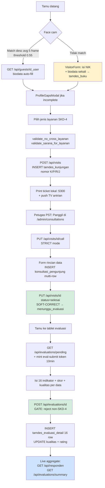
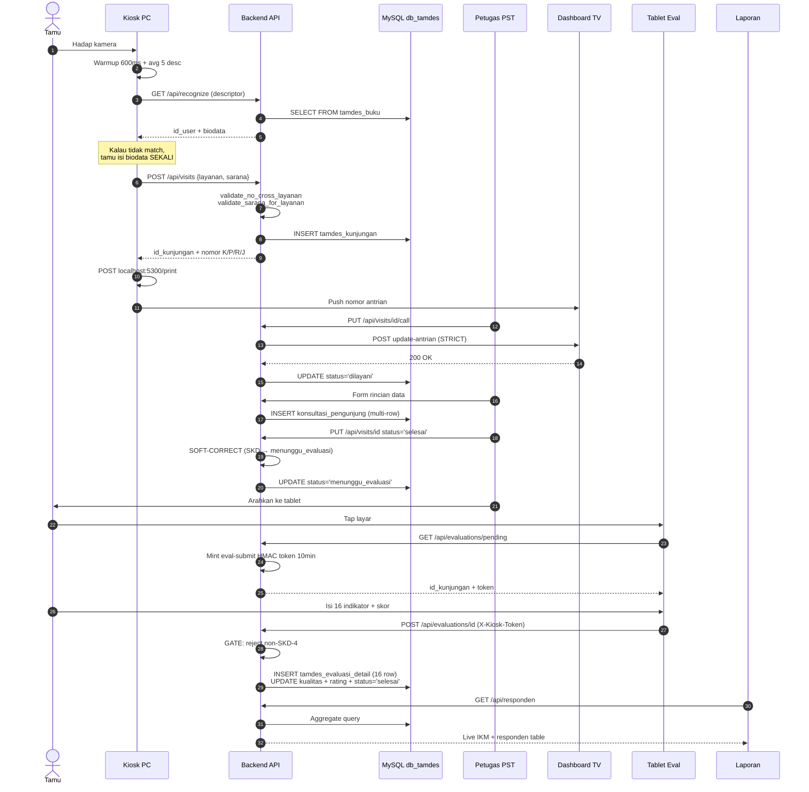

# Flow SKD: Paper-Based (Legacy) → Digital Terintegrasi (Bukutamu Baru)

**Konteks**: Sebelum sistem Bukutamu, pelayanan PST BPS Maluku Utara dijalankan **paper-based**: tamu mengisi buku tamu fisik di meja resepsionis, lalu — setelah dilayani — mengisi kuesioner SKD (Survei Kebutuhan Data) kertas yang **mengulang biodata yang sama**. Sistem baru menghilangkan double-entry ini dengan **face recognition + link otomatis** dari kiosk ke tablet evaluasi.

Dokumen ini membandingkan kedua flow secara visual dan menjelaskan apa yang berubah di setiap touchpoint.

---

## 1. Executive Summary

| Aspek | Legacy (paper) | Baru (digital terintegrasi) |
|---|---|---|
| Identifikasi tamu | Tanda tangan manual di buku tamu | Face recognition warmup 600ms → match desc avg dari 5 frame |
| Input biodata | **Dua kali**: buku tamu + kuesioner SKD | **Sekali** (auto-pull dari `tamdes_buku` via face match) |
| Nomor antrian | Diteriaki / panggil nama | Print thermal `localhost:5300` + tampil TV `dashboard-pst` |
| Form konsultasi | Petugas catat di buku besar / Excel | `konsultasi_pengunjung` multi-row dengan rincian data |
| Kuesioner SKD | Lembar kertas → kotak suara → rekap manual Excel | Tablet `/evaluation/{id}` → INSERT 16 row `tamdes_evaluasi_detail` |
| Link biodata ↔ evaluasi | Hilang (kertas terpisah, hanya nama tertulis ulang) | FK `id_kunjungan` cascade ke 3 child table |
| Rekap IKM tahunan | Tally manual akhir bulan / kuartal | Live query `GET /api/evaluations/summary?tahun=YYYY` |
| Risiko duplikasi data | Tinggi (tamu salah eja nama, instansi inkonsisten) | Rendah (1 `id_user` di `tamdes_buku`, multi-visit di-aggregate) |
| Hilangnya kuesioner fisik | Sering (kotak kepenuhan, terselip, basah) | Tidak mungkin (digital) |
| Waktu finalisasi rekap | Hari hingga minggu | Real-time |

---

## 2. Flow LEGACY (Paper-Based, Pre-Bukutamu)

### 2.1 Diagram swim-lane (ASCII)

```
TAMU                  RESEPSIONIS          PETUGAS PST          TABLET/KERTAS         REKAP
─────                 ───────────          ───────────          ─────────────         ─────

Datang ke kantor BPS  ┐
                      │
                      ▼
                   📓 Buku tamu fisik
                   (tulis: nama, NIK,
                    instansi, no telp,
                    keperluan, tanda tangan)
                      │
                      ▼
                   Sebut keperluan
                   (Konsultasi/Perpus/dll)
                      │
                      ▼
                   Diarahkan ke meja PST  ─────────────►  📋 Tamu duduk, tunggu petugas
                                                                   │
                                                                   ▼
                                                          Petugas catat di
                                                          buku besar/Excel:
                                                          - nama (lagi)
                                                          - instansi (lagi)
                                                          - rincian data diminta
                                                          - hasil konsultasi
                                                                   │
                                                                   ▼
                                                          Layanan selesai
                                                                   │
                                                                   ▼
                                                          📄 Petugas serahkan
                                                             lembar kuesioner SKD
                                                             (paper based)
                                                                   │
                                                                   ▼
                                                                                   Tamu isi:
                                                                                   - BIODATA ULANG
                                                                                     (nama, umur,
                                                                                      instansi, dll)
                                                                                   - 16 indikator
                                                                                     IKM skala 1-10
                                                                                   - skor keseluruhan
                                                                                       │
                                                                                       ▼
                                                                                   📦 Masuk kotak
                                                                                      saran/SKD
                                                                                       │
                                                                                       │  (kumpul
                                                                                       │   tiap akhir
                                                                                       │   minggu/bulan)
                                                                                       │
                                                                                       ▼
                                                                                                       Staf rekap manual:
                                                                                                       - Ketik ulang ke Excel
                                                                                                       - Hitung rata-rata
                                                                                                       - Bikin tabel IKM
                                                                                                       - Laporan triwulanan
                                                                                                       - Laporan tahunan ke pusat
```

### 2.2 Pain points (legacy)

1. **Double entry biodata**: tamu menulis nama, NIK, instansi minimal 2× (buku tamu + kuesioner SKD). Banyak tamu **menolak isi** kuesioner karena merasa sudah didata di awal.
2. **Inkonsistensi tulisan**: "BPS Provinsi Maluku Utara" ditulis "BPS Prov Malut", "BPS-Malut", "BPS MU" di sumber berbeda → susah agregat.
3. **Kuesioner SKD hilang**: kotak kepenuhan, lembar terselip, tinta luntur. Rate response sebenarnya jauh di atas data yang masuk rekap.
4. **Tidak ada link tamu ↔ evaluasi**: kalau ada komplain di kuesioner, tidak bisa di-trace ke visit spesifik. Hanya bisa lihat tanggal.
5. **Rekap lambat**: rata-rata IKM kuartal baru tersedia 2-3 minggu setelah kuartal berakhir.
6. **Tidak ada audit trail**: kalau kuesioner SKD dimanipulasi (mis. petugas isi sendiri), tidak ada cara verifikasi.
7. **Sarana & jenis layanan**: kategori tidak terstandardisasi — petugas bisa salah klasifikasi.

---

## 3. Flow BARU (Digital Terintegrasi — Bukutamu Monorepo)

### 3.1 Diagram swim-lane (ASCII)

```
TAMU             KIOSK PC (face cam)     BACKEND API              PETUGAS PST          TABLET EVAL          REKAP/LAPORAN
─────            ────────────────────    ───────────              ───────────          ───────────          ─────────────

Datang ke
kantor BPS
   │
   ▼
Hadap kamera   ────► Face detection
                     warmup 600ms
                     → sampling 5 frame
                     → averaging desc
                     → threshold 0.55
                       margin 0.08
                              │
                              ▼  Match?
                              ├─ YES ──────────► GET /api/guests/{id_user}
                              │                  → biodata auto-fill
                              │                              │
                              └─ NO ───────────► VisitorForm:
                                                 isi NIK + biodata
                                                 (SEKALI saja, masuk
                                                  tamdes_buku)
                                                              │
                                                              ▼
                                                 ProfileGapsModal
                                                 (kalau biodata
                                                  incomplete, fill gap)
                                                              │
                                                              ▼
                                                 Pilih jenis layanan
                                                 (grid 4 kolom):
                                                 → validate_no_cross_layanan
                                                 → validate_sarana_for_layanan
                                                              │
                                                              ▼
                                                 POST /api/visits
                                                 ↓
                                                 INSERT tamdes_kunjungan
                                                   id_user, jenis_layanan,
                                                   sarana, status='menunggu'
                                                   nomor_antrian (prefix
                                                   K/P/R/J untuk SKD inti,
                                                   D untuk DTSEN)
                                                              │
                                                              ▼
                                                 Cetak ticket via
                                                 http://localhost:5300/print
                                                 (escpos lokal di kiosk)
                                                              │
                                                              ▼
                                                 Push ke TV antrian
                                                 https://dashboard-pst.
                                                  bpsmalut.com
                                                              │
                                                              │  (tamu duduk di
                                                              │   ruang tunggu,
                                                              │   nomor tampil
                                                              │   di TV)
                                                              │
                                                              ▼
                                                                                       Petugas klik
                                                                                       "Panggil" di
                                                                                       /admin/consultations
                                                                                              │
                                                                                              ▼
                                                                                       PUT /api/visits/{id}/call
                                                                                       STRICT: kalau TV API
                                                                                         5xx/timeout → 502
                                                                                         + audit log
                                                                                              │
                                                                                              ▼
                                                                                       Form rincian data:
                                                                                       - rincian_data
                                                                                       - wilayah_data
                                                                                       - tahun_awal/akhir
                                                                                       - level_data
                                                                                       - status_data
                                                                                         (1=ada-sesuai,
                                                                                          2=ada-tdk-sesuai,
                                                                                          3=tidak ada)
                                                                                       - jenis/judul publikasi
                                                                                       - digunakan_nasional
                                                                                              │
                                                                                              ▼
                                                                                       PUT /api/visits/{id}
                                                                                       status='selesai'
                                                                                       ─ SOFT-CORRECT GATE ─
                                                                                       SKD-4 → paksa
                                                                                       'menunggu_evaluasi'
                                                                                       (kecuali bypass role)
                                                                                              │
                                                                                              ▼
                                                                                       INSERT konsultasi_
                                                                                         pengunjung
                                                                                         (multi-row, satu
                                                                                          row per rincian)
                                                                                              │
                                                                                              ▼  Petugas arahkan
                                                                                                  tamu ke tablet
                                                                                                  evaluasi
                                                                                                              │
                                                                                                              ▼
                                                                                                  GET /api/evaluations/pending
                                                                                                  → ambil visit terlama
                                                                                                  + jenis_layanan ∈ SKD-4
                                                                                                  → mint eval-submit token (10 menit, HMAC)
                                                                                                              │
                                                                                                              ▼
                                                                                                  Tamu isi 16 indikator
                                                                                                  skala 1-10:
                                                                                                  - Informasi tersedia
                                                                                                  - Persyaratan mudah
                                                                                                  - Prosedur jelas
                                                                                                  - ... (16 total)
                                                                                                  + skor keseluruhan 1-10
                                                                                                  + kualitas per data
                                                                                                    (yang status_data ∈ {1,2})
                                                                                                              │
                                                                                                              ▼
                                                                                                  POST /api/evaluations/{id}
                                                                                                  ─ GATE LAYER 3 ─
                                                                                                  Reject kalau visit
                                                                                                  bukan SKD-4
                                                                                                              │
                                                                                                              ▼
                                                                                                  INSERT tamdes_
                                                                                                    evaluasi_detail
                                                                                                    (16 row)
                                                                                                  UPDATE konsultasi_
                                                                                                    pengunjung.kualitas
                                                                                                  UPDATE tamdes_kunjungan:
                                                                                                    status='selesai'
                                                                                                    rating_pengunjung
                                                                                                    selesai_timestamp
                                                                                                    durasi_detik
                                                                                                                                          │
                                                                                                                                          ▼
                                                                                                                                  GET /api/responden
                                                                                                                                  (live aggregate)
                                                                                                                                  - per-instansi
                                                                                                                                  - per-triwulan
                                                                                                                                  - skd_eligible count
                                                                                                                                  - export CSV

                                                                                                                                  GET /api/evaluations/summary?tahun=YYYY
                                                                                                                                  - avg per indikator
                                                                                                                                  - IKM keseluruhan
                                                                                                                                  - breakdown per visit
                                                                                                                                  - live, real-time
```

### 3.2 Diagram Mermaid (render otomatis di GitHub markdown)



### 3.3 Diagram BPMN-style (Mermaid sequence)



---

## 4. Side-by-Side Comparison (Per-Step)

| Step | Legacy (Paper) | Baru (Digital) | Perubahan |
|---|---|---|---|
| **1. Identifikasi** | Tanda tangan + tulis nama di buku besar | Face recognition match (≤2 detik) | Eliminasi handwriting, NIK akurat |
| **2. Input biodata** | Tulis di buku tamu (kolom: nama, instansi, no telp, keperluan) | Auto-pull dari `tamdes_buku` kalau face match; kalau tidak, isi via `VisitorForm` (NIK + 12 field demografis) | **Sekali input** vs 2-3 kali |
| **3. Pilih layanan** | Sebut lisan ke resepsionis ("mau konsultasi data") | Tap grid 4-kolom 7 layanan + grid sarana | Standardisasi: tidak ada free-text yang harus diinterpretasi |
| **4. Antrian** | Diteriaki nama / "yang habis tadi siapa?" | Print thermal ticket nomor + tampil TV antrian | Tertib & visual |
| **5. Dilayani petugas** | Petugas catat manual di buku besar/Excel internal | Petugas isi `ConsultationDataForm` (rincian_data, wilayah, tahun, status_data, dst.) | Terstruktur, multi-row |
| **6. Finalisasi layanan** | Petugas tutup catatan, beri lembar SKD kertas | PUT status='selesai' → soft-corrected ke `menunggu_evaluasi` (defense in depth) | Tidak ada cara skip evaluasi untuk SKD-4 |
| **7. Kuesioner SKD** | Tamu **isi biodata LAGI** + 16 indikator + skor di kertas | Tablet auto-link via `id_kunjungan` — tamu **hanya isi rating** | Eliminasi double entry biodata |
| **8. Submit** | Masukkan ke kotak SKD | POST `/api/evaluations/{id}` dengan HMAC token (10 menit) | Audit trail + anti-replay |
| **9. Rekap** | Staf ketik ulang ke Excel akhir bulan | Live query `GET /api/evaluations/summary?tahun=YYYY` | Real-time, zero re-entry |
| **10. Laporan Responden Tahunan** | Tally manual nama instansi (sering double-count karena salah eja) | `GET /api/responden` group by `id_user` + filter `triwulan`/`skd` | Deduplikasi otomatis lewat FK |

---

## 5. Eliminasi Double Entry — Inti Perubahan

Bagian paling visible bagi tamu:

```
LEGACY                                  BARU
──────                                  ────

Buku tamu fisik:                        Face recognition (no manual write).
┌─────────────────────────┐
│ Nama:    ______________ │              Atau VisitorForm sekali:
│ NIK:     ______________ │              ┌────────────────────────────┐
│ Instansi:______________ │              │ NIK / faceMatch result     │
│ No HP:   ______________ │              │ → POST /api/guests          │
│ Keperluan:_____________ │              │ → INSERT tamdes_buku        │
│ Tanda tangan: _________ │              │   (jadi id_user permanen)  │
└─────────────────────────┘              └────────────────────────────┘
                                                      │
            ┌─── (dilayani) ───┐                      │
            ▼                                         │
                                                      │  (face-match next time)
Kuesioner SKD kertas:                                 │
┌─────────────────────────┐                           │
│ BIODATA ULANG:          │ ← redundant               │
│ Nama:    ______________ │                           ▼
│ Umur:    ______________ │                Tablet evaluasi:
│ Instansi:______________ │                ┌────────────────────────────┐
│ Pendidikan:____________ │                │ (biodata tidak ditanya     │
│ Pekerjaan:_____________ │                │  ulang — sudah ter-link    │
│ ─────────────────────── │                │  via id_kunjungan)         │
│ 16 INDIKATOR (1-10):    │                │                            │
│  1. ___  9.  ___        │                │ 16 INDIKATOR (1-10)        │
│  2. ___ 10.  ___        │                │ + skor keseluruhan         │
│  ...    ...             │                │ + kualitas per data        │
│ 16. ___                 │                │                            │
│                         │                │ POST /api/evaluations/{id} │
│ Skor keseluruhan: ___   │                └────────────────────────────┘
└─────────────────────────┘
```

---

## 6. Data Lineage (Di Mana Data Berakhir)

### Legacy
```
buku tamu fisik   ──► (tidak pernah didigitalkan)   ──► (arsip lemari)
kuesioner SKD     ──► kotak  ──► Excel manual       ──► laporan PDF triwulanan
```

### Baru
```
Face desc      ──► (in-memory match, tidak disimpan)
tamdes_buku    ──► id_user PERMANEN
                       │
                       ▼
tamdes_kunjungan (id_user FK)
                       │
                       ├──► konsultasi_pengunjung (FK id_kunjungan, multi-row)
                       │            │
                       │            └──► kualitas updated saat eval submit
                       │
                       ├──► dtsen_konsultasi (FK id_kunjungan, single-row, untuk DTSEN)
                       │
                       └──► tamdes_evaluasi_detail (FK id_kunjungan, 16-row)
                                    │
                                    ▼
                            GET /api/evaluations/summary
                            GET /api/responden
                            GET /api/queue_stats
                            ────────────────────────
                            Semua live, no manual rekap
```

---

## 7. Implikasi Operasional

| Kategori | Sebelum | Sesudah |
|---|---|---|
| Waktu rata-rata input data per kunjungan | 5-7 menit (tulis 3 tempat) | <30 detik (face match instan + tap layanan) |
| Tingkat completion kuesioner SKD | ~30-40% (banyak skip / hilang) | ~90%+ (mandatory step di tablet) |
| Akurasi nama instansi | Sering inkonsisten | Auto-suggest dari `tamdes_buku` history |
| Latency laporan IKM | 2-3 minggu setelah kuartal | Real-time |
| Tracability komplain | Hanya tanggal | id_kunjungan + audit_log full trail |
| Beban admin (rekap manual) | 1-2 hari kerja per bulan | 0 (live query) |
| Hilangnya data | Sering | Tidak (backup harian DB) |
| Cetak ticket | Tidak ada | Otomatis di kiosk PC |
| Panggilan ke TV antrian | Manual sebut nama | Push ke `dashboard-pst.bpsmalut.com` |

---

## 8. Catatan: "Legacy" di Dokumen Ini

Istilah **"legacy"** di dokumen ini merujuk pada **era pre-digital paper-based**, bukan repo `/var/www/html/bukutamu-legacy/` (frozen archive PHP app pre-konsolidasi 2026-05-16).

| Istilah | Maksud |
|---|---|
| **Legacy paper / Pre-Bukutamu** | Era buku tamu fisik + kuesioner SKD kertas. Dokumen ini fokus di sini. |
| **bukutamu-legacy (folder)** | Snapshot PHP app pre-konsolidasi 2026-05-16. Sudah digital tapi: tidak punya DTSEN, tidak punya 3-tier taxonomy, tidak punya 3-gate finalisasi. Lihat `docs/BUKUTAMU_VS_LEGACY.md`. |
| **Bukutamu / Monorepo baru** | Sistem saat ini di `/var/www/html/bukutamu/`. |

Catatan: bukutamu PHP legacy **sudah** mengeliminasi double-entry biodata SKD — ini adalah pencapaian app PHP-era, bukan baru di monorepo. Yang **baru di monorepo** adalah hardening domain layer (DTSEN, gate, sarana whitelist) seperti dijelaskan di `BUKUTAMU_VS_LEGACY.md`.

---

## 9. Reference

| Topik | Path |
|---|---|
| Perbandingan code-level (legacy PHP vs monorepo baru) | `docs/BUKUTAMU_VS_LEGACY.md` |
| Audit komprehensif | `docs/AUDIT_2026-05-16.md` |
| Face recognition pipeline | `frontend/src/components/kiosk/FaceRecognize.tsx`, `frontend/src/lib/face-detection.ts` |
| Visitor registration form | `frontend/src/components/kiosk/VisitorForm.tsx` |
| Profile gap filler | `frontend/src/components/kiosk/ProfileGapsModal.tsx` |
| Evaluation form | `frontend/src/components/kiosk/EvaluationForm.tsx` |
| Consultation data form | `frontend/src/components/admin/ConsultationDataForm.tsx` |
| Backend evaluation | `backend/application/modules/api/controllers/Evaluations.php` |
| Backend responden agregat | `backend/application/modules/api/controllers/Responden.php` |
| Print server lokal | `print/` (canonical) → di-copy ke tiap kiosk PC, jalan di `:5300` |
