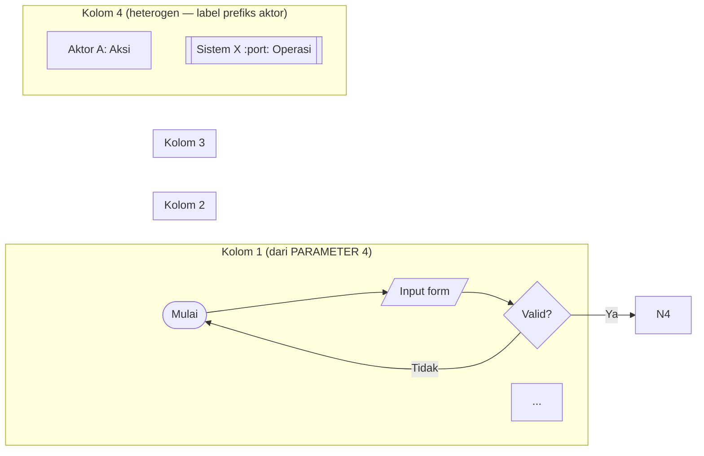

# Prompt untuk Generate Dokumen Flow Diagram Aplikasi (4-Swimlane, ISO 5807)

> **Cara pakai**:
> 1. Isi tujuh parameter di **PARAMETER YANG ANDA TENTUKAN** di bawah.
> 2. Copy seluruh blok yang diapit ```` ``` ```` (mulai dari `# Tugas` sampai akhir blok), paste ke agen AI (Claude Code, Claude Desktop, Cursor, atau LLM lain yang punya akses ke filesystem proyek).
> 3. Agen akan: (a) eksplorasi kode aktual, (b) ajukan pertanyaan klarifikasi 1–2 hal, (c) tulis dokumen flow `.md` dengan lima diagram Mermaid swimlane + narasi + tabel + catatan inkonsistensi.
> 4. Untuk regenerate **satu diagram saja** tanpa men-generate ulang seluruh dokumen, gunakan **Blok B** di bagian paling bawah file ini.

> **Sumber inspirasi**: dokumen `docs/FLOW_PENGUNJUNG.md` di proyek `bukutamu` dipakai sebagai contoh referensi gaya. Jangan menebak — agen wajib eksplorasi kode aktual.

---

## PARAMETER YANG ANDA TENTUKAN

| # | Parameter | Penjelasan | Isi |
|---|---|---|---|
| 1 | Nama aplikasi | Nama produk yang dibuatkan dokumennya | **`[ISI: contoh — Aplikasi Antrian Online Klinik]`** |
| 2 | Tumpukan teknologi | Frontend / Backend / Basis data secara ringkas | **`[ISI: contoh — Next.js (FE) + FastAPI (BE) + PostgreSQL]`** |
| 3 | Lokasi kode | Path absolut root repo + sub-path frontend/backend kalau berbeda | **`[ISI: contoh — /var/www/html/klinik, FE: frontend/, BE: backend/]`** |
| 4 | Empat swimlane | Empat kolom yang muncul di diagram. Sebut aktor / komponen per kolom | **`[ISI: contoh — Pasien/Web, Backend/API, PostgreSQL/db_klinik, Petugas/Sistem Eksternal]`** |
| 5 | Skenario inti | 4–5 skenario kritis yang dijadikan diagram detail (di luar diagram Master) | **`[ISI: contoh — Pendaftaran baru, Pendaftaran ulang, Pelayanan dokter, Pembayaran, Resep elektronik]`** |
| 6 | Bahasa output | `id` (Bahasa Indonesia formal) atau `en` (English) atau `mix` (ID + istilah teknis EN) | **`[ISI: id]`** |
| 7 | Output file path | Lokasi file `.md` yang dihasilkan (relatif ke root repo) | **`[ISI: docs/FLOW_PENGUNJUNG.md]`** |

> Ganti tujuh isi di atas, lalu copy blok di bawah.

---

```
# Tugas

Susun **satu dokumen Markdown lengkap** berjudul `[PARAMETER 1]` yang berisi lima *cross-functional flowchart* (diagram alur lintas-fungsi) untuk seluruh perjalanan satu pengguna di aplikasi tersebut — dari masuk sistem sampai keluar. Dokumen akan disimpan ke `[PARAMETER 7]`.

# Standar yang Dipakai

- **Simbol diagram**: ISO 5807:1985 (terminator oval, proses persegi panjang, keputusan belah ketupat, masukan/keluaran jajar genjang, penyimpanan data silinder, subrutin persegi panjang garis ganda).
- **Swimlane / cross-functional**: praktik gaya BPMN — empat kolom sesuai `[PARAMETER 4]`.
- **Bahasa diagram**: Mermaid `flowchart` dengan `subgraph` per swimlane (render-able via Pandoc + mermaid-filter).
- **Bahasa narasi**: `[PARAMETER 6]`.

# Aturan Main — PATUHI SEMUA

1. **Eksplorasi kode aktual DULU, jangan menebak dari dokumen lama**. Baca routing utama (mis. `App.tsx`, `router.py`, `urls.py`), trace tiap halaman/endpoint, baca controller, baca schema DB. Bila sumber kebenaran (kode) konflik dengan dokumen yang ada, **kode menang** — catat konflik sebagai "Catatan Inkonsistensi" di akhir dokumen.
2. **Setiap simpul keputusan (belah ketupat) WAJIB punya cabang Ya dan Tidak yang ter-resolve**. Tidak boleh ada ujung menggantung. Cabang yang kembali ke simpul sebelumnya dibolehkan untuk menggambar retry/koreksi.
3. **Setiap diagram WAJIB diiringi narasi 1–2 paragraf** di bawahnya. Narasi menjelaskan komponen utama, arah data, dan alasan keputusan rancangan. Diagram tanpa narasi tidak dihitung selesai.
4. **Kolom keempat (Petugas / Sistem Eksternal) menggabungkan aktor heterogen** — setiap simpul di kolom itu wajib diberi prefiks aktor pada labelnya, mis. `Petugas Loket: Klik Panggil` atau `Print Service :5300: Cetak`. Pembaca harus bisa membedakan aktor tanpa membaca konteks.
5. **Status transition di node**: setiap simpul yang men-update kolom status di tabel utama diberi anotasi `(status: X → Y)`.
6. **Jangan menambahkan fitur, endpoint, atau tabel yang tidak ada di kode**. Bila ragu, tulis "tidak ditemukan di kode" alih-alih menebak.
7. **Jangan menulis diagram dalam satu blok mermaid raksasa kalau bisa dipisah** menjadi lima diagram terpisah. Diagram tunggal di atas 60 simpul terlalu padat untuk dibaca.
8. **Output adalah satu file `.md` saja**. Jangan men-generate `.docx`, `.pdf`, atau format lain. User akan konversi sendiri lewat Pandoc bila perlu.

---

# Langkah Kerja

## Langkah 1 — Eksplorasi (sebelum menulis apapun)

Lakukan dan rangkum temuannya secara internal:

1. **Routing FE**: baca file routing utama. Daftar semua route yang relevan dengan alur pengguna ujung-ke-ujung. Untuk setiap halaman: path file, transisi keluar (mana ke mana), API call yang dipanggil, validasi/gate frontend.
2. **Endpoint BE**: daftar semua endpoint yang muncul di routing FE + endpoint yang dipanggil polling/background. Untuk setiap endpoint: method + path + role guard + tabel DB yang disentuh + operasi DML.
3. **Schema DB**: baca DDL (`CREATE TABLE ...`) untuk semua tabel yang relevan. Catat PK, FK, status ENUM, dan CASCADE perilaku.
4. **Gate logic**: identifikasi *gate* (otorisasi, soft-correct, rate limit, strict-mode call ke service eksternal). Catat di endpoint mana, dengan logic apa, dan jalur bypass-nya bila ada.
5. **Aktor eksternal**: identifikasi sistem eksternal yang berinteraksi (print server, dashboard antrian, gateway pembayaran, webhook, dll.). Catat protokol, port, dan payload.

Bila ada pertanyaan klarifikasi yang ambigu (mis. urutan halaman di kode beda dengan dokumen yang ada), **tanya pengguna 1–2 hal kritis dulu** sebelum lanjut menulis. Jangan tanya hal yang sudah bisa dijawab dari kode.

## Langkah 2 — Susun Dokumen

Struktur dokumen yang dihasilkan (gunakan heading level konsisten):

```
# `[PARAMETER 1]` — Flow Pengguna

> Tanggal · Versi · Cakupan

[Paragraf pembuka 2–3 kalimat]

## Daftar Isi

## 1. Aktor dan Swimlane
   Tabel: kolom × aktor yang masuk × catatan
   Aturan label aktor di kolom 4.

## 2. Konvensi Simbol (ISO 5807)
   Tabel pemetaan simbol → Mermaid syntax → pemakaian.
   Aturan setiap decision wajib Ya/Tidak.

## 3. Diagram 1 — Master: [Mulai] hingga [Selesai]
   ```mermaid
   flowchart LR
     subgraph LANE1 ["Kolom 1"]
       ...
     end
     subgraph LANE2 ["Kolom 2"]
       ...
     end
     ...
     [edges cross-lane]
   ```
   ### Narasi Diagram 1
   [1–2 paragraf]

## 4. Diagram 2 — [Skenario 1 dari PARAMETER 5]
   (sama struktur: blok mermaid + ### Narasi)

## 5. Diagram 3 — [Skenario 2]
## 6. Diagram 4 — [Skenario 3]
## 7. Diagram 5 — [Skenario 4]
   (Bila PARAMETER 5 berisi 5 skenario, tambah Diagram 6.)

## 8. Tabel Ringkasan
   8.1 Transisi Status (kolom: dari, ke, endpoint, pemicu, scope)
   8.2 Token/Session/Auth Material (kalau ada — TTL, di-mint di, diperiksa di, header)
   8.3 Endpoint × Tabel DB × Diagram (kolom: endpoint, tabel, operasi, muncul di diagram)

## 9. Catatan Inkonsistensi dengan Dokumen Lain
   [Daftar bernomor; kalau tidak ada inkonsistensi, tulis "Tidak ditemukan inkonsistensi pada audit ini, tanggal X."]

## 10. Referensi Kode Sumber
   Tabel: komponen × lokasi file.
```

## Langkah 3 — Bentuk Diagram

Untuk setiap diagram, ikuti pola:



Pemetaan simbol → Mermaid (gunakan persis):

| ISO 5807 | Mermaid syntax |
|---|---|
| Terminator (oval) | `id([Mulai])` |
| Proses (rectangle) | `id[Aksi]` |
| Keputusan (rhombus) | `id{Pertanyaan?}` |
| Masukan/Keluaran (parallelogram) | `id[/Input atau Output/]` |
| Penyimpanan data (cylinder) | `id[(nama_tabel)]` |
| Subrutin (predefined process) | `id[[Aksi penting]]` |

## Langkah 4 — Catatan Inkonsistensi

Saat eksplorasi kode, kalau Anda menemukan **perbedaan antara kode aktual dan dokumen yang sudah ada di repo** (mis. `README.md`, `docs/*.md`, komentar tertinggal), catat di bagian §9. Format tiap temuan: **(a)** apa yang ditulis dokumen, **(b)** apa kondisi aktual di kode, **(c)** sumber kebenaran (file + nomor baris bila relevan), **(d)** dampak (mis. "menyesatkan pengembang baru" atau "membuat asesor salah paham").

Bila tidak menemukan inkonsistensi apapun, tulis kalimat eksplisit:

> "Tidak ditemukan inkonsistensi antara dokumen yang ada dan kode aktual pada audit tanggal [TANGGAL]."

Jangan biarkan §9 kosong tanpa pernyataan — pernyataan eksplisit lebih berguna daripada heading kosong.

# Aturan Tambahan untuk Diagram Master

Diagram 1 (Master) **harus** memenuhi:

1. Memuat seluruh perjalanan pengguna dari simpul `[Mulai]` sampai `[Selesai]` — satu jalur kontinu yang bercabang sesuai keputusan.
2. **Tidak detail per endpoint** — cukup nama proses umum ("Daftar baru", "Lakukan pembayaran"). Detail endpoint disimpan ke diagram 2–5.
3. Bila ada percabangan grup/jenis layanan/role di sistem, **gambarkan cabang itu di Master**, jangan disimpan ke diagram detail saja. Tapi: cabang grup tidak boleh muncul di posisi yang salah — pastikan ia diletakkan di titik kode benar-benar bercabang, bukan di mana dokumen lama mengiranya bercabang.

# Output Akhir

Tulis hasil ke `[PARAMETER 7]`. Setelah selesai, balas pengguna dengan:

- Konfirmasi file tertulis (path + jumlah baris).
- Tiga sampai lima poin highlight temuan menarik (mis. inkonsistensi yang terdeteksi, simpul keputusan yang punya bypass tersembunyi, sistem eksternal yang belum terdokumentasi).
- Tanya: "Ada bagian yang ingin di-revisi atau ditambah?" — jangan langsung dianggap selesai.

Jangan kirim balasan panjang berisi seluruh dokumen kembali — pengguna akan baca file langsung.
```

---

## Blok B — Prompt Pendek (regenerate satu diagram saja)

> Pakai blok ini kalau dokumen utama sudah jadi tapi Anda mau iterasi satu diagram saja tanpa regenerate seluruh dokumen.

```
Tugas: gambar ulang Diagram [NAMA_DIAGRAM, mis. "Diagram 4 — Pelayanan dan Finalisasi"] di file [PARAMETER 7] untuk aplikasi [PARAMETER 1].

Konteks ringkas (eksplorasi dulu kalau perlu, jangan menebak):
- Empat swimlane: [PARAMETER 4].
- Skenario diagram ini fokus pada: [DESKRIPSI SKENARIO — mis. "alur dari status=antri sampai status=selesai, termasuk gate otorisasi dan strict-mode call ke service eksternal"].
- Endpoint utama yang harus muncul: [DAFTAR ENDPOINT, atau "biarkan agen identifikasi"].
- Tabel DB yang harus muncul: [DAFTAR TABEL, atau "biarkan agen identifikasi"].

Permintaan:
1. Cek kode aktual untuk semua endpoint + tabel yang relevan dengan skenario di atas.
2. Hasilkan diagram dalam blok ```mermaid``` dengan empat subgraph (swimlane), simbol ISO 5807, setiap decision punya Ya/Tidak yang ter-resolve.
3. Tulis narasi 1–2 paragraf di bawah diagram (komponen utama, arah data, alasan keputusan rancangan).
4. Replace bagian diagram lama di [PARAMETER 7] dengan yang baru. Jangan sentuh bagian lain dari dokumen.
5. Pastikan kolom 4 (Petugas/Sistem Eksternal) tetap memakai prefiks aktor di setiap label simpul.

Output: hanya diagram + narasi yang menggantikan bagian lama, plus satu kalimat ringkas perbedaan dari versi sebelumnya.
```

---

## Tips Setelah Generate

1. **Validasi nama tabel/endpoint** dengan `grep -rn "nama_tabel\b"` atau `grep -rn "/api/path"` di repo sebelum sign-off — kalau agen salah ketik nama (rare tapi mungkin), koreksi manual lebih cepat daripada regenerate.
2. **Render Mermaid** di [mermaid.live](https://mermaid.live/) per diagram sebelum commit — beberapa kombinasi karakter (mis. `<br/>` di label, kurung kurawal, koma di tooltip) bisa break rendering Mermaid versi tertentu. Bila render bersih, baru commit.
3. **Bila diagram terlalu padat** (>40 simpul di satu blok), minta agen pecah menjadi dua sub-diagram (mis. "Diagram 4a — Panggilan strict-mode", "Diagram 4b — Form & finalisasi") daripada minta agen "padatkan diagram" — yang biasanya menghasilkan label tergulung.
4. **Catatan Inkonsistensi** sering jadi temuan paling berguna untuk audit kode. Bila §9 berisi ≥3 temuan, pertimbangkan buat issue tracker terpisah supaya tidak hilang.
5. **Hindari overlap dengan dokumen Rancangan Sistem / Petunjuk Operasional**: dokumen flow ini fokus *alur kontrol* (siapa memanggil apa, kapan, dengan data apa). Bila muncul "cara mengisi field" atau "screenshot tombol", itu ranah Petunjuk Operasional — hapus dari dokumen flow.
6. **Konversi ke `.docx`** (opsional): `pandoc [PARAMETER 7] -o flow.docx --filter mermaid-filter --reference-doc=ref.docx`. Hitung halaman di Word; bila kurang, perpanjang narasi tiap diagram, jangan tambah diagram filler.
